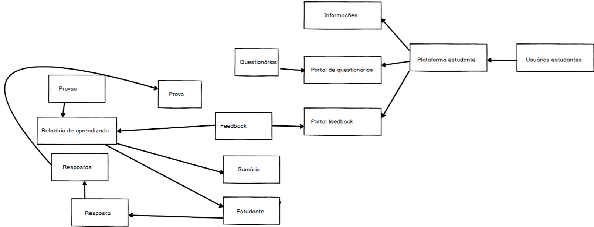

= Projeto Tutor de Estudos INEP: Relatório Intermediário
:toc:
:toc-title: Sumário
:figure-caption: Figura
:sectnums:

////
https://github.com/cnt5bs/2017-ic-rodrigo
////

== Introdução

A pesquisa consiste na idéia de que existem alunos que desejam complementar os seus estudos por meio de questões elaboradas de acordo com as regras estabelecidas pelo INEP para os exames do ENADE.
Dispondo de um retorno informativo a respeito das suas respostas, espera-se ajudar o estudante com orientações a respeito de temas que ainda precisam ser melhor compreendidos.

A pesquisa tem como principal objetivo identificar as entidades de necessárias compreensões para estabelecer relacionamentos entre resultados da prova do INEP, resultados esperados da prova do INEP, resultados esperados dos tipos de estudantes usuários da plataforma, resultados esperados por professores.
Padrões de alunos foram encontrados durante a pesquisa. Os alunos são úteis para uma análise sobre seus estudos quando dividos pelos seus padrões de históricos escolares, estudantis e sociológicos.
Estes tópicos representam as influencias que  um aluno sofre durante sua educação, desde o ensino básico até o superior.

As diferentes categorias de históricos escolares são determinados pelo conjunto das caracteristicas dos:
tipos de ensino que obtiveram, 
tipos de instituições em que estudaram, 
tipos de experiências vividas pelos mesmos, 
//*(italo: qual a razão deste critério de categorização:)*
informações pessoais dos mesmos (localização geográfica, documentação, renda, e entre outros).
//*(italo: este projeto tem a proposta de analisar provas do INEP?
//acho que não. devem ser analisadas as respostas dos estudantes.)*
Serão analisados resultados do estudante, em comparação com os outros de suas determinadas categorias. Por sua vez, os resultados das categorias são, também analisadas entre si.
Os resultados devem gerar um fluxo de estudos que auxilie o aluno em seu estudo.

//*(italo: o objetivo é estudar para a prova do ENADE? não. a ideia é de inspiração, apenas. não se estuda para passar no ENADE; estuda-se para adquirir conhecimento.)*
Além disto a pesquisa visa, entregando um feedback e um fluxo seguro de estudos, ajudar alunos a aperfeiçoar conhecimentos e técnicas de estudo. Professores podem analisar resultados obtidos com determinadas perguntas, também.

== INEP

Instituto que possui o Exame referência no Brasil de avaliação de Instituições de Educação de ensino Superior. 
O Instituto Nacional de Estudos e Pesquisas Educacionais Anísio Teixeira (INEP) é o orgão responsável pela elaboração e subsidiação do exame ENADE.
//*(italo: qual a relação deste trecho com a pesquisa?)*
O Instuto faz pesquisas e levantamentos neste ramo do ensino, além de ser considerado confiável.
Análisar o ENADE é de nosso interesse pois podemos o utilizar como inspiração para elaboração de critérios e levantamento requisitos em nossa pesquisa. 

O ENADE do ensino superior (Sinaes) tem como objetivo assegurar que o processo de avaliação das Instituições de Educação Superior (IES) ocorram de acordo com requisitos mínimos de aprendizagem, estabelecidos pelo MEC.
//mais importante do ensino superior no Brasil.

//*(italo: o modo verbal deve se terceira pessoa)*
A pesquisa, considera, como referência, os critérios e as respostas elaboradas pelo exame do INEP para o ensino superior (Sinaes).
Este exame visa avaliar a qualidade da educação oferecida pelas IES. 
A análise, na pesquisa, do estudante, acontecerá durante o estudo do aluno, trazendo a ele simulados, dicas, observações, e pontos positivos negativos de seu estudo, e com isso construindo um fluxo de estudo que melhore seus resultados. 
Assim o resultado deste exame poderá ser cruzado com os da plataforma gerada com base na pesquisa.

O exame servirá de base avaliativa e objetivo final para o aluno.

== Cronograma

. (A1) Princípios de engenharia de software - Estudo e exploração tecnológica
.. Modelos de domínio
.. Modelos de aplicações orientados a objetos

. (A2) Questionários de Múltipla Escolha - MCQ
.. Estudo do Guia de Elaboração e Revisão de Itens do INEP
.. Modelo de domínio MCQ

. (A3) Tutor de Estudo INEP
.. Requisitos do tutor de estudo
.. Modelo arquitetural
.. Modelo de implementação
.. Código-fonte
.. Verificação e validação

. (A4) Registro do trabalho de pesquisa

Uma vista mais detalhada das atividades do projeto encontra-se mostrada na <<fig:cronograma>>.

{counter2:nfig}
[[fig:cronograma, Fig {counter:nfig}]]
_Figura {nfig}. Cronograma detalhado das atividades._ +
image:fig/cronograma.png[] +
Fonte: proponente deste projeto

== Atividades (até Janeiro)

//*(italo: evite o uso de cores em relatórios, a não ser em casos nas quais a pesquisa a isso se refira)*

.Índice de estados das tarefas

|===

| ( C )| concluído 
| ( A )| em andamento 
| ( N )| não começado 
|===

++++
 
 -Explorações tecnológicas: Princípios de Engenharia de software.

<ul>
  <li >Modelos de domínio ( C )</li>
  <li >Modelos de Aplicações orientados a objetos ( C )</li>
</ul>

 -Questionários de Múltipla Escolha - MCQ.

<ul>
  <li >Estudo do Guia de Elaboração e Revisão de Itens do INEP ( C ) </li>
  <li >Modelo de domínio MCQ ( C )</li>
</ul>

 -Tutor de Estudo INEP.

<ul>
      <li >Requisitos do tutor de estudo ( A )</li>
      <li >Modelo arquitetural ( A )</li>
</ul>

++++

== Resultados e insucessos

=== Resultados

*Estudo tecnológico*:
Modelo de domínio -- 
foi concluída, com sucesso, a tarefa de estudo tecnológico. 
//*(italo: como se pode comprovar o sucesso desta tarefa?)*
Foram desenvolvidos desenhos de padrões de estudantes e professores de ensino superior, com isso foi possível o desenvolvimento das restrições de domínio. Além disto, foram elaborados os fluxos de atividades atuais e idéias, para que com isso fosse possível visualizar a idéia de solução.
Um dos resultados deste pensamento é o modelo de domínio elaborado.
Já tinha sido apresentado ao tópico em sala de aula, no bacharelado da PUCSP, onde nas matérias de engenharia de software e laboratório de programação, elaborávamos modelos de domínio.
Conhecimentos posteriores, vieram de prática e do livro "Análise estruturada de sistemas", dos autores Chris Gane e Trish Sarson.
//*(italo: introduzir referência de acordo com a ABNT)*
Gane, C.;Sarson, T., Análise estruturada de sistemas: 1. ed. São Paulo: Livros Técnicos e Científicos Editora S.A., 1983

O livro foi um acerto para a pesquisa.
//*(italo: de que maneira um leitor deste relatório irá se beneficiar deste 'resultado'?)*
Pois trata de maneira cautelosa fluxos e diagramas de processos. Ao definir a estrutura dos fluxos é possível elaborar modelos menores que correspondem mais diretamente a necessidade
dos estudantes do ensino superior. A categorização de diferentes contextos se torna mais simples e mais clara após determinação dos processos e entidades existentes.

*Estudo tecnlógico*: 
Modelos de aplicações orientados a objetos -- 
foi concluído com sucesso a tarefa de estudo tecnológico de modelos de aplicações orientados a objetos.
//*(italo: como se pode comprovar o sucesso desta tarefa?)*
Com o estudo, foi elaborado, por exemplo, o modelo de estudante.
//*(italo: evite repetição de texto. isto indica uma ideia já apresentada.)*
Já havia sido apresentado ao tópico durante o curso de bacharelado da PUCSP, onde nas matérias de orientação a objetos e laboratório de programação, foram elaboradas e arquitetadas aplicações orientadas a objetos.
Conhecimentos posteriores, vieram de prática e do livro "Domain Driven Design", do autor Eric Evans, que por mais que não trata-se diretamente do paradigma, trazia de desenvolvimento de aplicações com o paradigma.
//*(italo: introduzir referência de acordo com a ABNT)*
EVANS, E. Domain Driven Design: 2. ed. Rio de Janeiro: ALTA BOOKS, 2010
//*(italo: de que maneira um leitor deste relatório irá se beneficiar deste 'resultado'?)*
O livro trás técnicas de modelagem de objetos voltados e visados a necessidade contextual enfrentada, assim, se distanciando de soluções somente técnológicamente arquitetadas. O livro foi importantíssimo para a elaboração, organização e arquitetura das entidades contextuais da pesquisa.
Tratam de maneira fácil, ágil, e inteligente dos assuntos.

{counter2:nfig}
[[fig:diag-mcq, Fig {counter:nfig}]]
_Figura {nfig}. Diagrama do modelo de estudante._ +
image:fig/ModeloUsuarioIC.png[] +
Fonte: elaborado pelo autor

*Questionários de Múltipla Escolha* - MCQ: 
Estudo do Guia de Elaboração e Revisão de Itens do INEP --
O estudo foi realizado e concluído.
//*(italo: como se pode comprovar o sucesso desta tarefa?)*
O seguinte modelo da entidade de questionários foi elaborado inspirado no Guia de Elaboração e Revisão de Itens do INEP.
Por mais que, o arquivo disponibilizado sobre a elaboração dos itens do exame de instituições superiores do Brasil, não estivesse mais disponível online, no site do INEP.
//*(italo: este é um dos problemas relacionados com referência de natureza 'digital', uma das razões de não serem aceitas em trabalhos de pesquisa, a não ser quando a fonte encontra-se cadastrada por algum órgão responsável por catalogação.)*
A pesquisa então seguiu em frente utilizando outras fontes confiáveis.
//*(italo: seria apropriado afirmar que o INEP não é uma fonte confiável?)*
O INEP, por mais que seja uma Instituição confiável, ele deixou de ser nossa fonte de regras de revisão de itens. É uma inspiração, porém, deixou de ser a principal fonte.
Foram encontradas fontes, confiáveis, do meio acadêmico, que nos permitiu elaborar um modelo mental do questionário do INEP.

{counter2:nfig}
[[fig:diag-mcq, Fig {counter:nfig}]]
_Figura {nfig}. Diagrama do modelo dequestionários._ +
image:fig/QuestionariosModeloIC.png[] +
Fonte: elaborado pelo autor

*Questionários de Múltipla Escolha* - MCQ: 
Modelo de domínio MCQ --

O modelo de domínio MCQ foi elaborado e esta sendo utilizado para o desenvolvimento da arquitetura que será utilizada na solução.

Foi elaborado um modelo ilustrado na <<fig:diag-mcq>>.

//*(italo: este diagrama está muito 'detalhado'. convém particioná-lo de acordo com algum critério.)*

{counter2:nfig}
[[fig:diag-mcq, Fig {counter:nfig}]]
_Figura {nfig}. Diagrama do modelo de domínio dos MCQs._ +
 +
Fonte: elaborado pelo autor

////
   
  
  </li>
////

*Questionários de Múltipla Escolha* - MCQ:
Requisitos do tutor de estudo -- 
Os requisitos náo começaram a ser levantados pois houve um atraso para encontrar a documentação do INEP, até encontrar uma fonte confiável, e os estudos sobre modelo de domínio se mostraram complexos demais em comparação com o que foi imaginado.

//=== Insucessos

//?

////

  <h1>1.5 Conclusões até o momento</h1>
////

== Conclusões até o momento

Os livros lidos para o entendimento do assunto foram acertos no desenvolvimento da pesquisa, pela forma que tratavam o paradigma que estamos estudando (orientação a objetos).

//*(italo: qual a origem da ausência de 'fontes'?)*
Inicialmente seria utilizado o sistema online do INEP para consulta do Guia de Elaboração e Revisão de Itens do INEP, documento que foi retirado da plataforma online do INEP.
Com este problema:
Não ter fontes secundárias para o desenvolvimento do estudo do questionário do INEP, foi muito prejudicial ao desenrolar da pesquisa e consequentemente ao cronograma. 
Com o desenvolvimento da pesquisa, foi necessário a busca por outras fontes confiáveis.
Destas, extraímos as informações que precisávamos.

//*(italo: esta constatação é prérequisito de qualquer trabalho de pesquisa.)*
//Deveríamos ter pesquisado fontes acadêmicas com informações extras e até mesmo iguais, que fossem confiáveis, antes de começar o estudo.

O mais importante do modelo elaborado sobre a estrutura da pesquisa, é, identificar o tipo de usuário por trás de cada informação, com a maior precisão possível.
//*(italo: como se pode determinar que a 'precisão' foi atingida?)*
O quanto mais próxima a pesquisa estiver de um padrão estatístico de resultados por categorização de estudante, mais precisa estará nossa identificação de padrão de usuário.
Esta documentação deve ser criteriozamente armazenada levando em consideração a situação geográfica, acadêmica, profissional, social, e governamental do estudante.
Assim poderemos estabelecer uma relação entre o contexto do estudante e o que ele esta errando, para podermos o orientar melhor.

//*(italo: requisitos são propostos a partir das necessidades e metas do usuário.)*
A meta do estudante na pesquisa, participando do projeto, é melhorar seu, e suas metodologias de, estudo.
A meta do professor está em análisar o resultado de perguntas obtidos em estudantes.
Os requisitos devem ser modelados tendo como inspiração requistos do INEP e a elaboração do modelo.
Não faz sentido serpará-los, e a pesquisa foi prejudicada por não considerarmos todos os aspectos de requisitos durante a elaboração do modelo.

O mais importante para a pesquisa a partir desta data, é começarmos a elaboração da integração entre o modelo e os requistos levantados posteriormente, ao início da elaboração da modelagem. 
//*(italo: isto caracteriza um erro de processo de desenvolvimento.)*
A modelagem, por ter sido iniciada antes do levantamento de requisitos, foi refatorada para atender de forma mais explícita as necessidades dos requisitos.
Descasar a modelagem do levantamento de requisitos foi um erro do processo de desenvolvimento. Não foi observado que os requisitos e o modelo possuíam dependencias processuais e operacionais entre si.

//*(italo: o tempo restante para a realização do projeto é suficiente para a conclusão do projeto? porquê?)*
O tempo restante é suficiente para a conclusão do projeto pois os tópicos mais difíceis foram solucionados, por exemplo, o modelo de estudante, e como levantar este modelo, Modelos estatísticos para padronização dos resultados e a forma de elaborar um fluxograma que efetivamente auxilie o estudante.
O modelo arquitetural utilizará dos conceitos de "Domain Driven Design" (Desenho dirigido ao domínio), assim nosso modelo e restrições serão intensamente implementadas via arquitetura.
A implementação da solução é estensa, mas depois da modularização da aplicação o foco será este.
Portanto, feito isso a pesquisa deve prosseguir para o modelo arquitetural e modelo de implementação.
//*(italo: o cronograma deverá ser revisado? quais as suas eventuais alterações? como isso irá garantir que o projeto seja encerrado com 'sucesso'?)*
As tarefas do cronograma que estão registradas como (A3) (a partir do item "b") deverão ter seu início adiados para fevereiro. O tempo de análise e decisão arquitetural acabou mais complexo do que se esperava. Pois afim de trazer um fluxograma de estudos, foram elaborados vários modelos matemáticos para relacionar aos padrões de resultados. Elaboração de modelos matemáticos na análise do negócio não havia sido considerada.
Em contra partida, o tempo de verificação e validação será reduzido por utilizarmos uma camada de testes unitários na arquitetura da solução. Camada que otimizará nossos testes e validações.
Também o tempo de correção de erros e bugs encontrados, encaixadas na atividade de "código fonte" será drásticamente reduzido.

Com estas revisões, a pesquisa pode ser concluída.