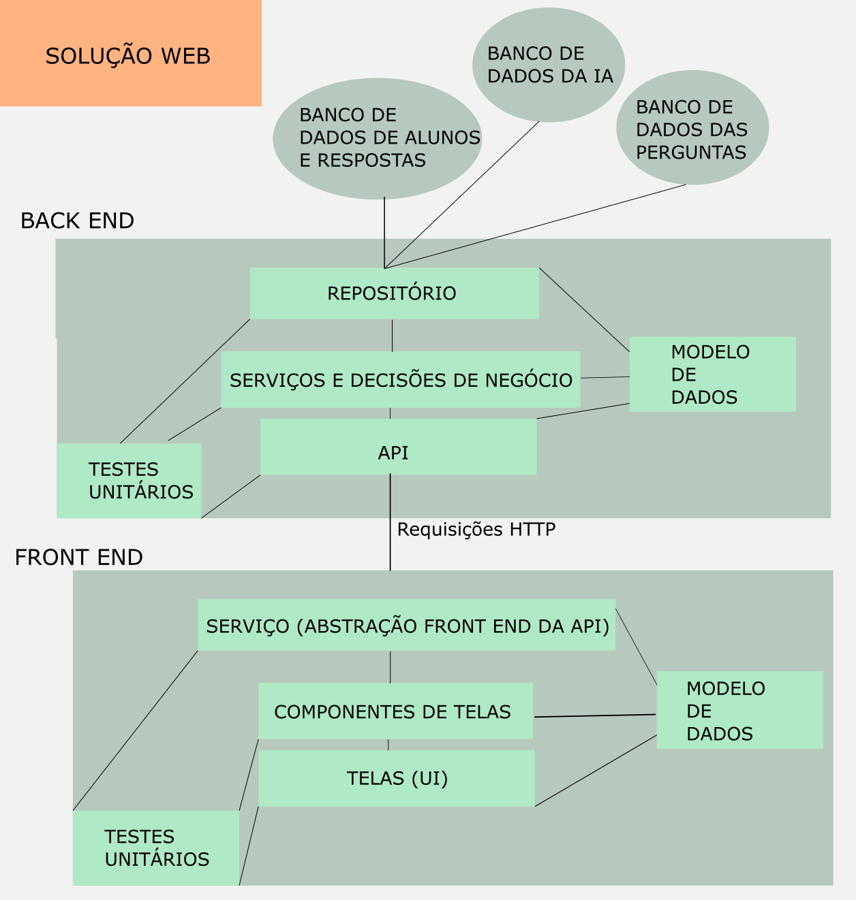
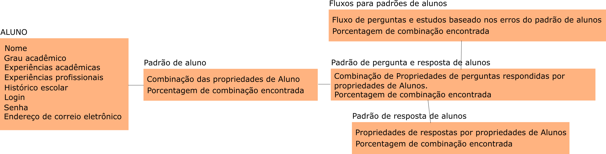

= Projeto Tutor de Estudos INEP: Relatório Intermediário
:toc:
:toc-title: Sumário
:figure-caption: Figura
:sectnums:

////
2018/03/09: revisado por italo
////

////
https://github.com/cnt5bs/2017-ic-rodrigo
////

== Introdução

// italo
// pesquisa=investigação que busca descobrir novos conhecimentos
// Uma pesquisa "consiste de uma ideia"?
A pesquisa estuda alunos que desejam complementar os seus estudos por meio de questões elaboradas de acordo com as regras estabelecidas pelo INEP para os exames do ENADE.
Dispondo de um retorno informativo a respeito das suas respostas, espera-se ajudar o estudante com orientações a respeito de temas que ainda precisam ser melhor compreendidos.

A pesquisa tem como principal objetivo identificar as entidades de necessárias compreensões para estabelecer relacionamentos entre resultados da prova do INEP, resultados esperados da prova do INEP, resultados esperados dos tipos de estudantes usuários da plataforma, resultados esperados por professores.
//FEITO: italo: o que são "padrões de alunos"?
Padrões de alunos foram encontrados durante a pesquisa.
Padrões de alunos são definidos a partir da permutação de suas propriedades, que seriam além de seu nome, endereço de correio eletrônico, a instituição aonde estuda e entre outros.
Cruzando as propriedades de alunos que responderam as mesmas questões é possível encontrar padrões dentre suas propriedades e respostas para as questões.
O sistema terá o fará o reconhecimento desses padrões de alunos por meio de um aprendizado de máquina, descrito na arquitetura do sistema.
// FEITO: italo: alunos são "úteis"?
Os cadastros dos alunos são utilizados para uma análise sobre seus estudos quando dividos pelos seus padrões de históricos escolares, estudantis e sociológicos.
// FEITO: italo: aluno "sofre" durante a sua educação?
Estes tópicos representam as influências que um aluno recebe durante sua educação, desde o ensino básico até o superior.

// italo: o que são "históricos escolares" neste contexto?
As diferentes categorias de históricos escolares são determinados pelo conjunto das caracteristicas dos:
tipos de históricos escolares, 
tipos de instituições em que estudaram, 
tipos de experiências vividas pelos mesmos, 
informações pessoais dos mesmos (localização geográfica, documentação, renda, e entre outros).
//FEITO: italo: se a ideia do projeto é de ajudar o aluno na complementação de seus estudos, como a comparação será utilizada neste sentido?
Serão analisados as respostas do estudante, em comparação com os outros de suas determinadas categorias.
Isto vai ajudar a futuramente o sistema, via aprendizado de máquina, a orientar o aluno.
//FEITO: italo: cuidado! a palavra "resultado" foi utilizada no sentido de "dados" logo acima. abaixo, o sentido é diferente!
Por sua vez, os dados das categorias são, também analisadas entre si.
Os resultados devem gerar um fluxo de estudos que auxilie o aluno em seu estudo.

Além disto a pesquisa visa, entregando um _feedback_ e um fluxo seguro de estudos, ajudar o aluno a complementar conhecimentos e, também, empregar técnicas de estudo adicionais. 
Professores podem analisar os resultados obtidos com determinadas perguntas, também. A análise dos resultados ajudaria o professor a aplicar perguntas em suas provas, norteando-o conforme o perfil de seus alunos.
//FEITO: italo: por qual razão um professor precisaria disso?

== INEP

// FEITO: italo: instituto "possui" algum exame?
Instituto que aplica o Exame referência no Brasil de avaliação de Instituições de Educação de ensino Superior. 
O Instituto Nacional de Estudos e Pesquisas Educacionais Anísio Teixeira (INEP) é o orgão responsável pela elaboração e subsidiação do exame ENADE.
O Instuto faz pesquisas e levantamentos neste ramo do ensino. 
//FEITO: o que aconteceria se fosse "não confiável"?
//FEITO: italo: use o modo impessoal, ao invés de "nosso".
Análisar o ENADE é de interesse da pesquisa pois podemos o utilizar como inspiração para elaboração de critérios e levantamento do modelo das entidades da pesquisa. 
Por exemplo, o formato das perguntas que serão levadas em consideração, perguntas são entidades da pesquisa.
//FEITO: e quais seriam esses "requisitos"?

//FEITO: italo: como um aluno se beneficia nos seus estudos, utilizando um órgão responsável pelo processo de avaliação de instituições?
//FEITO: italo: a primeira ocorrência de "Sinaes" deve ser por extenso.
O ENADE do ensino superior (Sistema Nacional de Avaliação da Educação Superior - Sinaes) tem como objetivo assegurar que o processo de avaliação das Instituições de Educação Superior (IES) ocorram de acordo com requisitos mínimos de aprendizagem, estabelecidos pelo MEC.
O que beneficia o aluno no sentido de ter garantido suas condições de avaliação.

A pesquisa, considera, como referência, os critérios e as respostas elaboradas pelo exame do INEP para o ensino superior (Sinaes), Enade (Exame Nacional de Desempenho de Estudantes).
Este exame visa avaliar a qualidade da educação oferecida pelas IES. 
//FEITO: qual exame?
//FEITO: italo: estudante e aluno são sinônimos?
A análise, na pesquisa, do aluno, acontecerá durante o estudo do aluno, trazendo a ele simulados, dicas, observações, e pontos positivos negativos de seu estudo, e com isso construindo um fluxo de estudo que o ajude em seus estudos. 
//FEITO: lembre-se que a ideia é de ajudar o estudante nos seus estudos...

== Cronograma

. (A1) Princípios de engenharia de software - Estudo e exploração tecnológica
.. Modelos de domínio
.. Modelos de aplicações orientados a objetos

. (A2) Questionários de Múltipla Escolha - MCQ
.. Estudo do Guia de Elaboração e Revisão de Itens do INEP
.. Modelo de domínio MCQ

. (A3) Tutor de Estudo INEP
.. Requisitos do tutor de estudo
.. Modelo arquitetural
.. Modelo de implementação
.. Código-fonte
.. Verificação e validação

. (A4) Registro do trabalho de pesquisa

Uma vista mais detalhada das atividades do projeto encontra-se mostrada na <<fig:cronograma>>.

{counter2:nfig}
[[fig:cronograma, Fig {counter:nfig}]]
_Figura {nfig}. Cronograma detalhado das atividades._ +
image:fig/cronograma.png[] +
Fonte: proponente deste projeto

== Atividades 

.Índice de estados das tarefas

|===

| ( C )| concluído 
| ( A )| em andamento 
| ( N )| não começado 
|===

++++
 
 -Explorações tecnológicas: Princípios de Engenharia de software.

<ul>
  <li >Modelos de domínio ( C )</li>
  <li >Modelos de Aplicações orientados a objetos ( C )</li>
</ul>

 -Questionários de Múltipla Escolha - MCQ.

<ul>
  <li >Estudo do Guia de Elaboração e Revisão de Itens do INEP ( C ) </li>
  <li >Modelo de domínio MCQ ( C )</li>
</ul>

 -Tutor de Estudo INEP.

<ul>
      <li >Requisitos do tutor de estudo ( C )</li>
      <li >Modelo arquitetural ( A )</li>
</ul>

++++

== Resultados e Insucessos

=== Resultados

*Estudo tecnológico*:
Modelo de domínio -- 
foi concluída, com sucesso, a tarefa de estudo tecnológico. 
Foram desenvolvidos desenhos de padrões de estudantes e professores de ensino superior, com isso foi possível o desenvolvimento das restrições de domínio.
Além disto, foram elaborados os fluxos de atividades atuais e idéias, para que com isso fosse possível visualizar a idéia de solução.
Um dos resultados deste pensamento é o modelo de domínio elaborado.
Já tinha sido apresentado ao tópico em sala de aula, no bacharelado da PUCSP, onde nas matérias de engenharia de software e laboratório de programação, elaborávamos modelos de domínio.
Conhecimentos posteriores, vieram de prática e do livro "Análise estruturada de sistemas", dos autores Chris Gane e Trish Sarson.
// italo: corrigir de acordo com o formato ABNT
Gane, C.;Sarson, T., Análise estruturada de sistemas: 1. ed. São Paulo: Livros Técnicos e Científicos Editora S.A., 1983

//FEITO: italo: o que significa "tratar fluxos e diagramas de maneira cautelosa"?
//FEITO: são "fluxos" do quê?
Pois trata de maneira atenciosa fluxos e diagramas de processos. Foi boa parte do livro em montagem de fluxos de processos.
O aluno possuí um fluxo de experiência dentro da plataforma, este, foi desenhado utilizando os conceitos deste livro. Também, os dados que foram e estão sendo modelados no modelo arquitetural estão 
sendo inspirados no conhecimento adquirido neste livro.
//FEITO: italo: o que significa um "modelo menor"?
Ao definir a estrutura dos fluxos é possível elaborar modelos com menor complexidade, isto é, entropia dentro de seu sistema, e que correspondem mais diretamente à necessidade dos estudantes do ensino superior.
A categorização de diferentes contextos se torna mais simples e mais clara após determinação dos processos e entidades existentes.

*Estudo tecnológico*: 
Modelos orientados a objetos de aplicações -- 
foi concluída, com sucesso, a tarefa de estudo tecnológico de modelos de aplicações orientados a objetos.
O sucesso se dá pelo fato de conseguirmos estabelecer modelos enxutos para as entidades da Pesquisa.
Estes que serão utilizados no modelo arquitetural da plataforma.
//Feito: italo: qual o critério de "sucesso"?
Com o estudo, foi elaborado, por exemplo, o modelo de estudante.
Já havia sido apresentado ao tópico durante o curso de bacharelado da PUCSP, onde nas matérias de orientação a objetos e laboratório de programação, foram elaboradas e arquitetadas aplicações orientadas a objetos.
Conhecimentos posteriores, vieram de prática e do livro "Domain Driven Design", do autor Eric Evans, que por mais que não trata-se diretamente do paradigma, trazia de desenvolvimento de aplicações com o paradigma.
// italo: não está no formato ABNT <---------------------------------------------
EVANS, E. Domain Driven Design: 2. ed. Rio de Janeiro: ALTA BOOKS, 2010
O livro traz técnicas de modelagem de objetos voltados e visados à necessidade contextual enfrentada, assim, se distanciando de soluções somente técnológicamente arquitetadas.
//FEITO: italo: evite superlativos ("importantíssimo") em textos técnicos
O livro foi relevante para a elaboração, organização e arquitetura das entidades contextuais da pesquisa.
Trata de maneira fácil, ágil, e inteligente dos assuntos. // italo: acredito ser este o propósito de um texto técnico

{counter2:nfig}
[[fig:diag-mcq, Fig {counter:nfig}]]
_Figura {nfig}. Diagrama do modelo de estudante._ +
image:fig/ModeloUsuarioIC.png[] +
Fonte: elaborado pelo autor

//FEITO: italo: precisa introduzir a sigla "MCQ"
*Questionários de Múltipla Escolha* - MCQ (Multiple Choice Question - Questão de múltipla escolha): 
Estudo do Guia de Elaboração e Revisão de Itens do INEP --
O estudo foi realizado e concluído.
O seguinte modelo da entidade de questionários foi elaborado a partir do Guia de Elaboração e Revisão de Itens do INEP.
Durante a pesquisa foi identificado que o documento não estava mais disponível. Encontrou-se a necessidade então de procurar o documento em outro local.
Foi possível encontrar o Guia de Elaboração e Revisão de Itens do INEP no site de outra prova aplicada pelo orgão. A "provinha brasil".

//ABNT
//FEITO: italo: se o arquivo não estava mais disponível, como foi possível utilizã-lo?

{counter2:nfig}
[[fig:diag-mcq, Fig {counter:nfig}]]
_Figura {nfig}. Diagrama do modelo dequestionários._ +
image:fig/QuestionariosModeloIC.png[] +
Fonte: elaborado pelo autor

*Questionários de Múltipla Escolha* - MCQ: 
Modelo de domínio MCQ --

Durante a pesquisa foi elaborado um estudo sobre o domínio que deveria ser utilizado para elaborar o sistema arquitetural do projeto de software.

O modelo de domínio MCQ foi elaborado e está sendo utilizado para o desenvolvimento da arquitetura da solução.

Foi elaborado um modelo ilustrado na <<fig:diag-mcq>>.

{counter2:nfig}
[[fig:diag-mcq, Fig {counter:nfig}]]
_Figura {nfig}. Diagrama do modelo de domínio dos MCQs._ +
image:fig/ModeloMCQIC.png[] +
Fonte: elaborado pelo autor
//<-----------------------------------------------------------------------

*Questionários de Múltipla Escolha* - MCQ:
Requisitos do tutor de estudo -- 

Os requisitos foram levantados e foi feito um desenho das telas e funcionalidades que o sistema precisa possuir.
Foi elaborado o modelo ilustrado, começando na <<fig:diag-tela1>>.

Como ilustrado, o aluno, fará o registro dos tópicos que deseja estudar.
Após esta tarefa, irá fazer um teste inicial, para o sistema descobrir o que o aluno já sabe sobre o tema.
Feito isso, o sistema vai definir um fluxograma inicial de estudos para aperfeiçoamento dos tópicos citados.
O aluno então poderá fazer outros testes definidos pelo sistema como ideais ao padrão de aluno encontrado.

{counter2:nfig}
[[fig:diag-tela1, Fig {counter:nfig}]]
_Figura {nfig}. Tela de montagem dos tópicos a serem estudados do aluno._ +
image:fig/Tela1.png[] +
Fonte: elaborado pelo autor

{counter2:nfig}
[[fig:diag-tela2, Fig {counter:nfig}]]
_Figura {nfig}. Tela de questionário inicial do aluno._ +
image:fig/Tela2.png[] +
Fonte: elaborado pelo autor

{counter2:nfig}
[[fig:diag-tela3, Fig {counter:nfig}]]
_Figura {nfig}. Tela de mural do aluno._ +
image:fig/Tela3.png[] +
Fonte: elaborado pelo autor

{counter2:nfig}
[[fig:diag-tela4, Fig {counter:nfig}]]
_Figura {nfig}. Tela de resultados do aluno._ +
image:fig/Tela4.png[] +
Fonte: elaborado pelo autor

//<----------------------------------------------------------------------------------------------------------------
*Questionários de Múltipla Escolha* - MCQ:
Modelo arquitetural --

O modelo arquitetural começou a ser desenvolvido. 
A pesquisa possui definidos estes modelos:
-Modelo arquitetural da solução web.
    Ilustrado na figura: <<fig:diag-arquitetura>>
-Modelo arquitetural de montagem de padrões de alunos por aprendizado de máquina.
    Representado na figura: <<fig:diag-ia>>
-Modelo de dados de usuários, perguntas e respostas.
    Representado na figura: <<fig:diag-perguntas>>

{counter2:nfig}
[[fig:diag-arquitetura, Fig {counter:nfig}]]
_Figura {nfig}. Modelo arquitetural da solução web._ +
 +
Fonte: elaborado pelo autor

{counter2:nfig}
[[fig:diag-ia, Fig {counter:nfig}]]
_Figura {nfig}. Modelo arquitetural da machine learning._ +
 +
Fonte: elaborado pelo autor

{counter2:nfig}
[[fig:diag-perguntas, Fig {counter:nfig}]]
_Figura {nfig}. Modelo arquitetural da machine learning._ +
image:fig/Questionarios.png[] +
Fonte: elaborado pelo autor

== Consideração Final

Os livros lidos para o entendimento do assunto foram acertos no desenvolvimento da pesquisa, pela forma que tratavam o paradigma que estamos estudando (orientação a objetos).

Inicialmente seria utilizado o sistema online do INEP para consulta do Guia de Elaboração e Revisão de Itens do INEP, documento que foi retirado da plataforma online do INEP.
Foi pensado então, procurar nas plataformas online de suas provas aplicadas por um documento que correspondesse ao Guia de Elaboração e Revisão de Itens do INEP.
Foi encontrado Guia de Elaboração e Revisão de Itens do INEP no site da "Provinha da Brasil".
Destas, extraímos as informações que precisávamos. 

O mais importante do modelo elaborado sobre a estrutura da pesquisa, é, identificar o tipo de usuário por trás de cada informação, com a maior precisão possível.
O quanto mais próxima a pesquisa estiver de um padrão estatístico de resultados por categorização de estudante, mais precisa estará nossa identificação de padrão de usuário.
Esta documentação deve ser criteriosamente armazenada levando em consideração a situação acadêmica, profissional, social, e governamental do estudante. 
//FEITO italo: qual a relação disso com o objetivo (resultado a ser alcançado) desta pesquisa? por exemplo: como se relaciona situação geográfica com o aprendizado de um aluno?
Estes criterios são utilizados pelo software via um aprendizado de máquina que trará para os padrões de usuário, diferentes tipos de fluxos de estudo. 
Definindo padrões de comportamento, o software poderá criar fluxos recomendados para cada um deles.
Fluxos que serão construídos conforme os erros e acertos em cada tópico que o aluno estudou.
Assim a pesquisa pode estabelecer uma relação entre o contexto do estudante e o que ele esta errando, para o software o orientar melhor.

A meta do estudante que está participando do projeto é melhorar seu estudo e suas metodologias de estudo. 
//FEITO: italo: frase mal formada

Os requisitos devem ser modelados tendo como inspiração requistos do INEP e a elaboração do modelo.

O mais importante para a pesquisa a partir desta data, é terminar o modelo arquitetural e a partir da arquitetura começarmos a implementação do software. A fase de testes acabará enxuta por conta de automatização de testes prevista na arqutietura.
//FEITO: italo: o que quer dizer "requisitos levantados posteriormente"? quando isso irá acontecer?

O próximo passo, após a arquitetura, é a implementação. O desenvolvimento arquitetural está na etapa de estabelecimento das funções de cada objeto. E como cada informação vai chegar ao banco.
A implementação terá como foco trabalho de programação, criação de banco de dados do software e configuração de ambiente e de servidores.

O tempo restante é suficiente para a conclusão do projeto pois os tópicos mais difíceis foram solucionados, por exemplo, o modelo de estudante, e como levantar este modelo. 
O sistema como requisitos mais importantes terá um sistema de responder perguntas, tendo ordenação de perguntas mais importantes para o padrão que o aluno se encaixa, e este requisito é o mais difícil de se atender. Envolve análise de permutações de alunos e suas respectivas respostas, e decisões de fluxos construídos pelo próprio software.
O requisito de trazer uma plataforma para responder perguntas é simples, pois somente envolve interface de usuário e gravação de suas respostas em um banco de dados.
//FEITO: italo: e quanto aos requisitos funcionais? quais são eles? quais são de maior complexidade? e os mais simples?
Modelos estatísticos para padronização dos resultados e a forma de elaborar um fluxograma que efetivamente auxilie o estudante.
O modelo arquitetural utilizará dos conceitos de "Domain Driven Design" (Desenho dirigido ao domínio), assim nosso modelo e restrições serão intensamente implementadas via arquitetura. 
O modelo de entidades se tornou complexo, os dados de uma propriedade de usuário deverá ser permutado com outras propriedades de outros usuários que responderam perguntas do mesmo tópico, este exemplo explica a escolha do "DDD" para a arquitetura do projeto.
//FEITO: italo: como saber se DDD será apropriado para resolver os requisitos do projeto?
A modularização da aplicação esta sendo feita no modelo arquitetural.
Terminada a modularização e finalizado a arquitetura da soluçaõ, será iniciada a implementação.

Já está sendo feito o modelo de implementação e o arquitetural.

A decisão arquitetural acabou mais complexo do que se esperava.
Tendo em vista partir para o código fonte, e criada a arquitetura da solução, o modelo de implementação tomará menos tempo do que o esperado.
Elaboração de modelos matemáticos na análise do negócio não havia sido considerada.
Em contrapartida, o tempo de verificação e validação será reduzido por utilizarmos uma camada de testes unitários na arquitetura da solução.
Camada que otimizará nossos testes e validações.
Também o tempo de correção de erros e _bugs_ encontrados, encaixadas na atividade de "código fonte" será reduzido. 
//FEITO: italo: evite o uso de superlativos em textos técnicos, como "drasticamente". 

Com estas revisões, a pesquisa pode ser concluída nos próximos 6 meses. 
//FEITO: italo: temos mais "6 meses" pela frente!

== Bibliografia:

- http://download.inep.gov.br/educacao_basica/provinha_brasil/documentos/2012/guia_elaboracao_itens_provinha_brasil.pdf[Provinha Brasil]
+
- https://impa.br/wp-content/uploads/2016/12/helio_f_costa.pdf[Mestrado sobre produção de itens]
+
- http://www.uel.br/grupo-estudo/gepema/Disserta%E7%F5es/2014_disserta%E7%E3o_Ademir.pdf[Mestrado sobre enunciados de itens]
+
- http://www.publicadireito.com.br/artigos/?cod=480167897cc43b2f[Bloom nas avaliações discentes]
+
- http://www.portalavaliacao.caedufjf.net/wp-content/uploads/2012/02/Guia_De_-Elaboração_De_Itens_LP.pdf[Guia de elaboração de itens]
+
- http://www.adventista.edu.br/_imagens/area_academica/files/guia-de-elaboracao-de-itens-120804112623-phpapp01(3).pdf[Guia para questões de múltipla escolha]
+
- http://www.athenaseducacional.com.br/media/files/135/135_87.pdf[Guia de elaboração de itens]
+