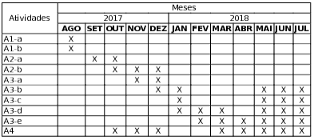
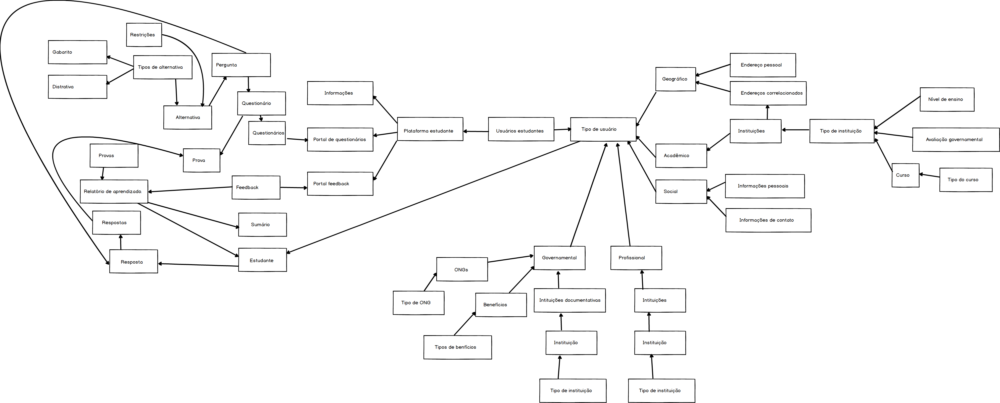

     
     
# Projeto Tutor de Estudos INEP
     
     

<h2>Sumário </h2>
<ul>
<li><b>Relatório 1</b></li>
  <li>1.1​ ​A​ ​pesquisa​</li>
  <li>1.2​ ​O​ ​INEP</li>
  <li>1.3 Cronograma</li>
  <li>1.4​ ​Resultados ​e​ insucessos</li>
  <li>1.5 Conclusões até o momento</li>
</ul>

<h1>1.1 A pesquisa</h1>

A pesquisa consiste na idéia de que existem alunos que desejam estudar para o exame do INEP do ensino superior, de forma que possam receber orientações constantes, conforme seus estudos. O aluno que deseja receber retorno sobre sua situação em comparação com o esperado pelo exame do INEP deve poder receber uma análise profunda, orientações do que estudar e como estudar.
 
A pesquisa tem como principal objetivo identificar as entidades de necessárias compreensões para estabelecer relacionamentos entre resultados da prova do INEP, resultados esperados da prova do INEP, resultados esperados dos tipos de estudantes usuários da plataforma, resultados esperados por professores. Tipos de estudantes são determinados por, por exemplo: tipos de ensino que obtiveram, tipos de instituições em que estudaram, tipos de experiências vividas pelos mesmos, informações pessoais dos mesmos. Serão análisados resultados esperados na prova do INEP para cada categoria com resultados obtidos por cada categoria de estudante.
 
Além disto a pesquisa visa, como objetivo identificar e melhorar a situação de alunos e professores que necessitam análisar resultados de outros alunos, e estudar para a prova de ensino superior do INEP.

<h1>1.2 O INEP</h1>
<h3>O Instituto Nacional de Estudos e Pesquisas Educacionais Anísio Teixeira</h3>

O INEP é o orgão que é responsável pela elaboração e subsidiação do exame mais importante do ensino superior no Brasil.
 
O exame do INEP do ensino superior (Sinaes) tem como objetivo assegurar que o processo de avaliação das Instituições de Educação Superior (IES) ocorram de acordo com os requisitos.
 
O exame visa justificar melhorias e investimentos, monetários ou não, no ensino superior brasileiro.
 
Estaremos, na pesquisa, levando como referência os critérios e as respostas elaboradas pelo exame do INEP para o ensino superior (Sinaes). Este exame visa avaliar a qualidade da educação oferecida pelas IES. A análise, na pesquisa, do estudante acontecerá durante o estudo do aluno que fará esta prova. Assim o resultado deste exame poderá ser cruzado com os da plataforma gerada com base na pesquisa.
 
O exame servirá de base avaliativa e objetivo final para o aluno.

<h1>1.3 O Cronograma</h1>

• (A1) Princípios de engenharia de software - Estudo e exploração tecnológica
 
a. Modelos de domínio
 
b. Modelos de aplicações orientados a objetos
 
• (A2) Questionários de Múltipla Escolha - MCQ
 
a. Estudo do Guia de Elaboração e Revisão de Itens do INEP
 
b. Modelo de domínio MCQ
 
• (A3) Tutor de Estudo INEP
 
a. Requisitos do tutor de estudo
 
b. Modelo arquitetural
 
c. Modelo de implementação
 
d. Código-fonte
 
e. Verificação e validação
 
• (A4) Registro do trabalho de pesquisa
 

 
<h3>Atividades (até novembro)</h3>
<b>Índice de cores</b>
<ul>

<li style="color:lightgreen">Cor verde: concluído.</li>
  <li style="color:yellow">Cor amarela: em andamento.</li>
  <li style="color:red">Cor vermelha: não começado.</li>
</ul>

 
 -Explorações tecnológicas: Princípios de Engenharia de software.

<ul>
  <li style="color:lightgreen">Modelos de domínio</li>
  <li style="color:lightgreen">Modelos de Aplicações orientados a objetos</li>
</ul>

 -Questionários de Múltipla Escolha - MCQ.

<ul>
  <li style="color:lightgreen">Estudo do Guia de Elaboração e Revisão de Itens do INEP</li>
  <li style="color:yellow">Modelo de domínio MCQ</li>
</ul>

 -Tutor de Estudo INEP.

<ul>
      <li style="color:red">Requisitos do tutor de estudo</li>
</ul>

<h1>1.4 Resultados e insucessos</h1>

<h3>Resultados</h3>

<ul>
  <li>Estudo tecnlógico: Modelo de domínio - Foi concluído com sucesso a tarefa de estudo tecnológico. Já tinha sido apresentado ao tópico em minha faculdade, PUCSP, onde nas matérias de engenharia de software e laboratório de programação, elaborávamos modelos de domínio. Conhecimentos posteriores, vieram de prática e do livro "Análise estruturada de sistemas", dos autores Chris Gane e Trish Sarson. O livro foi um acerto para a pesquisa. Pois trata de maneira cautelosa o paradigma de orientação a objetos.</li>
  <li>Estudo tecnlógico: Modelos de aplicações orientados a objetos - Foi concluído com sucesso a tarefa de estudo tecnológico de modelos de aplicações orientados a objetos. Já tinha sido apresentado ao tópico em minha faculdade, PUCSP, onde nas matérias de orientação a objetos e laboratório de programação, elaborávamos aplicações orientadas a objetos. Conhecimentos posteriores, vieram de prática e do livro "Domain Driven Design", do autor Eric Evans, que por mais que não trata-se diretamente do paradigma, trazia de desenvolvimento de aplicações com o paradigma. Outros livros como por exemplo: "Análise estruturada de sistemas", dos autores Chris Gane e Trish Sarson, e "Projeto Estruturado de Sistemas" da autora Meilir Page-Jones. Os livros foram acertos para a pesquisa. Pois tratam de maneira fácil, ágil, e inteligente dos assuntos.</li>
  <li>Questionários de Múltipla Escolha - MCQ: Estudo do Guia de Elaboração e Revisão de Itens do INEP - O estudo foi realizado e concluído. Por mais que, o arquivo disponibilizado sobre a elaboração dos itens do exame de instituições superiores do Brasil, não estivesse mais disponível online, no site do INEP.
   
  Isto foi um inconveniente para o trabalho, inconveniente, que nos forçou a procurar por outras fontes confiáveis para a elaboração do estudo.
   
  Foram encontradas fontes, confiáveis, do meio acadêmico, que nos permitiu elaborar um modelo mental do questionário do INEP.
  </li>
  <li>Questionários de Múltipla Escolha - MCQ: Modelo de domínio MCQ - O objetivo ainda não cumprido, pois foi descoberto que o modelo de domínio deve ser pensado conforme o desenvolvimento do estudo do INEP e ao levantamento dos requisitos do tutor do INEP.
  A análise do documento do INEP foi concluída porém, o levantamento dos requisitos ainda não foram terminados. O modelo de domínio deve ser arquitetado levando em consideração as multiplas restrições que teremos nos requisitos.
   
  Até o momento foi elaborado um modelo da seguinte maneira:
   
  
  </li>
<li>Questionários de Múltipla Escolha - MCQ: Requisitos do tutor de estudo - Os requisitos náo começaram a ser levantados pois houve um atraso para encontrar a documentação do INEP, até encontrar uma fonte confiável, e os estudos sobre modelo de domínio se mostraram complexos demais em comparação com o que foi imaginado.</li>
</ul>

  <h1>1.5 Conclusões até o momento</h1>
    

      Os livros lidos para o entendimento do assunto foram acertos no desenvolvimento da pesquisa, pela forma que tratavam o paradigma que estamos estudando (orientação a objetos).
       
      Não ter fontes secundárias para o desenvolvimento do estudo do questionário do INEP, foi muito prejudicial ao desenrolar da pesquisa e consequentemente ao cronograma. Deveríamos ter pesquisado fontes acadêmicas com informações extras e até mesmo iguais, que fossem confiáveis, antes de começar o estudo.
       
      O mais importante do modelo elaborado sobre a estrutura da pesquisa, é, identificar o tipo de usuário por trás de cada informação, com a maior precisão possível. Esta documentação deve ser criteriozamente armazenada levando em consideração a situação geográfica, acadêmica, profissional, social, e governamental do estudante. Assim poderemos estabelecer uma relação entre o contexto do estudante e o que ele esta errando, para podermos o orientar melhor.
       
      Os requisitos devem ser modelados em paralelo ao estudo do INEP e a elaboração do modelo.
      Não faz sentido serpará-los, e a pesquisa foi prejudicada por não considerarmos todos os aspectos de requisitos durante a elaboração do modelo.
       
      O mais importante para a pesquisa a partir desta data, é começarmos a elaboração da integração entre o modelo e os requistos levantados posteriormente, ao início da elaboração da modelagem. A modelagem, por ter sido iniciada antes do levantamento de requisitos, foi refatorada para atender de forma mais explícita as necessidades dos requisitos.
       
      Feito isso a pesquisa deve prosseguir para o modelo arquitetural e modelo de implementação. E dai prosseguir com o cronograma.
       
      A parte mais importante da pesquisa até o momento, é o entendimento de que o modelo de estudante, deve ser preciso para que uma inteligência consiga trazer melhores critérios de melhorias e melhores análises de resultados pós prova, questionário, e estudo.
  

