= Projeto Tutor de Estudos INEP: Relatório Final - Rodrigo Nogueira

:toc:
:toc-title: Sumário
:figure-caption: Figura
:sectnums:

////
2018/03/09: revisado por italo
////

////
https://github.com/cnt5bs/2017-ic-rodrigo
////

== Introdução

O trabalho de um aluno em uma instituição acadêmica pode ser avaliada de várias maneiras, uma das mais complicadas é utilizar o histórico de alunos para determinar se a performance de alguém foi satisfatória, e isso se dá porque é difícil criar os padrões de alunos conforme suas propriedades.

A pesquisa busca metodologias de avaliação do aluno utilizando técnicas de inteligência artificial e aprendizado de máquina para com estas ajudar na experiência e resultados de estudos dos alunos de instituições acadêmicas.
Foram selecionadas propriedades (de um aluno) para serem consideradas na criação dos padrões de alunos e suas respectivas provas e avaliações.

Primeiramente é feita a avaliação entregue pelo professor, a prova criada pelo professor. Após a avaliação do professor é feita a avaliação da máquina para determinar se o resultado que era esperado do aluno foi satisfatório ou não.

Para auxiliar na elaboração de prova e na avaliação da prova foi estudado o sistema de criação e avaliação de provas para o ensino superior do INEP (ENADE).

//INEP
Instituto que aplica o Exame referência no Brasil de avaliação de Instituições de Educação de ensino Superior. 
O Instituto Nacional de Estudos e Pesquisas Educacionais Anísio Teixeira (INEP) é o orgão responsável pela elaboração e subsidiação do exame ENADE.
O Instituto faz pesquisas e levantamentos neste ramo do ensino. 

Análisar o ENADE é de interesse da pesquisa pois podemos o utilizar como inspiração para elaboração de critérios e levantamento do modelo das entidades da pesquisa. 

O ENADE do ensino superior (Sistema Nacional de Avaliação da Educação Superior - Sinaes) tem como objetivo assegurar que o processo de avaliação das Instituições de Educação Superior (IES) ocorram de acordo com requisitos mínimos de aprendizagem, estabelecidos pelo MEC.
O que beneficia o aluno no sentido de ter garantido suas condições de avaliação.

A pesquisa, considera, como referência, os critérios e as respostas elaboradas pelo exame do INEP para o ensino superior (Sinaes), Enade (Exame Nacional de Desempenho de Estudantes).
Este exame visa avaliar a qualidade da educação oferecida pelas IES. 

Para a pesquisa, foram determinadas as metodologias de criação de avaliações do ENADE como base para criação das perguntas e alternativas dentro da plataforma da pesquisa. Estas são: Somente suportadas as criações de questionários com perguntas textuais (somente escritas, não possuem imagens) de resposta única, e com alternativas textuais.

Foram estudadas as metodologias que o ENADE utiliza para a construção de perguntas, avaliação das respostas, construção de questionário, e análise de alternativas, e com isso foram desenhados modelos de domínio para representar as entidades que precisariam ser representadas.

Feito o estudo das metodologias do ENADE, para aplicação da prova foram elaborados os seguintes modelos de domínio :

{counter2:nfig}
[[fig:diag-mcq, Fig {counter:nfig}]]
_Figura {nfig}. Diagrama do modelo de estudante._ +
image:fig/ModeloUsuarioIC.png[] +
Fonte: elaborado pelo autor

{counter2:nfig}
[[fig:diag-mcq, Fig {counter:nfig}]]
_Figura {nfig}. Diagrama do modelo dequestionários._ +
image:fig/QuestionariosModeloIC.png[] +
Fonte: elaborado pelo autor

{counter2:nfig}
[[fig:diag-mcq, Fig {counter:nfig}]]
_Figura {nfig}. Diagrama do modelo de domínio dos MCQs._ +
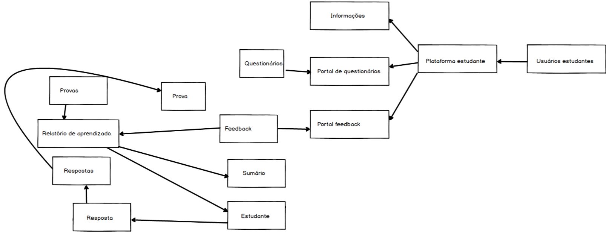 +
Fonte: elaborado pelo autor

Para auxiliar nos tópicos citados, elaboração da prova, fluxo e experiência de ensino de um aluno, utilizando das metodologias estudadas, foi criada uma plataforma de auxilio ao ensino em que o professor constrói a sua aula, e a experiência do aluno (ordenando e definindo o conteúdo de cada página que ele verá), escreve sobre o conteúdo que deseja, monta provas, e os alunos são avaliados e auxiliados pela plataforma.

É uma plataforma de ensino que auxilia o aluno em seus estudos avaliando, por meio de aprendizado de máquina, se o resultado foi o esperado para aquele perfil de aluno. Caso não sejam os resultados esperados, e o aluno tiver ido pior do que o esperado em alguma matéria, a plataforma de ensino recomenda ao aluno estudar outras matérias relacionadas para melhorar sua base conceitual.

O professor que utiliza a plataforma para montar as suas matéria possui um gerenciador de conteúdo que o permite montar uma sequência de slides da sua matéria, colocar vídeos, mais slides, criar páginas explicativas, escrever o conteúdo de sua matéria, organizar por tópicos, montar suas provas, determinar, mudar ou editar a ordem das páginas.
Para cada prova que o aluno faz, ele ganha uma pontuação no sistema, pontuação que ele poderá ver em uma página de "Análise dos dados", ao lado de uma análise de como o sistema esperava que ele fosse, e suas sugestões de matéria quando sua nota for menor do que a esperada.

As matérias relacionadas, que podem melhorar a base conceitual de um aluno, são definidas pelo próprio professor que cria a experiência de estudo da matéria em seu gerenciador de conteúdo. Assim as matérias recomendadas a um aluno que não conseguiu atingir o resultado esperado é uma recomendação do professor.

Utilizando desta plataforma, o aluno poderá ser avaliado conforme seu professor deseja, e com base no resultado de outras avaliações de outros alunos e a análise de suas propriedades, o sistema pode retirar padrões de alunos para dizer o que se era esperado de um aluno em alguma situação.

Com isso foram desenhadas estas telas como esboço de uam experiência simples de um aluno :

{counter2:nfig}
[[fig:diag-tela1, Fig {counter:nfig}]]
_Figura {nfig}. Tela de montagem dos tópicos a serem estudados do aluno._ +
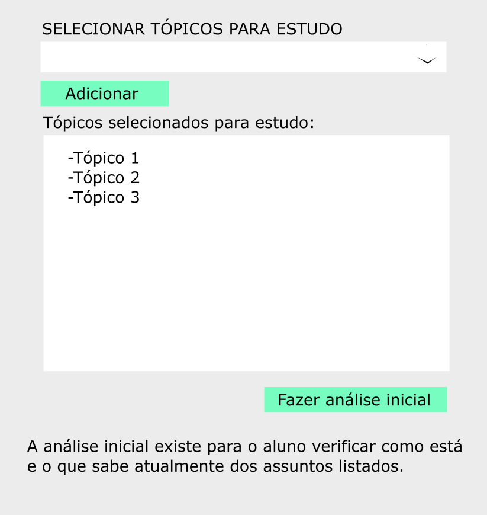 +
Fonte: elaborado pelo autor

{counter2:nfig}
[[fig:diag-tela2, Fig {counter:nfig}]]
_Figura {nfig}. Tela de questionário inicial do aluno._ +
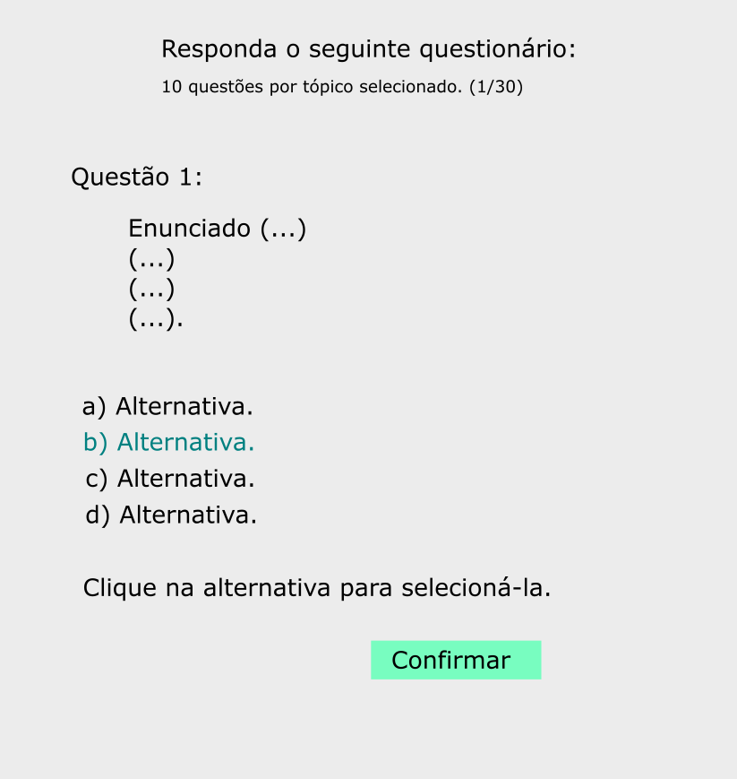 +
Fonte: elaborado pelo autor

{counter2:nfig}
[[fig:diag-tela3, Fig {counter:nfig}]]
_Figura {nfig}. Tela de mural do aluno._ +
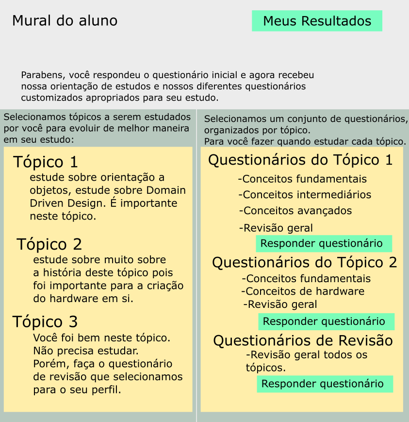 +
Fonte: elaborado pelo autor

{counter2:nfig}
[[fig:diag-tela4, Fig {counter:nfig}]]
_Figura {nfig}. Tela de resultados do aluno._ +
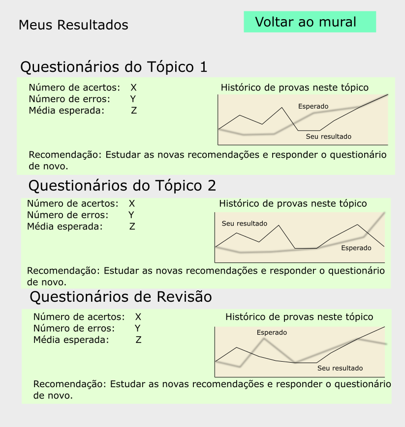 +
Fonte: elaborado pelo autor

Como a plataforma foi implementada com sucesso, foram elaboradas estas telas em Html para serem utilizadas na Web.

Com o intuito de fazer integrações com outros sistemas, foi construído um serviço Web que recebe questionários, em "JSON" (Javascript Object Notation). Assim, os questionários podem ser elaborados e validados em outro software. Assim podem ser inseridos na plataforma da pesquisa via internet e utilizados para avaliar os alunos como se tivessem sido desenvolvidos internamente.

== Metodologia

=== Pesquisa

*Modelos*:

Para a elaboração de um modelo de domínio foi importante a definição de várias entidades que existiram durante o estudo das metodologias do ENADE. Além das entidades provenientes da pesquisa feita sobre as metodologias do ENADE, houve a necessidade de elaborar vários modelos definindo a montagem da experiência dos usuários. Foi definido também os tipos de entidades de usuário que influenciam a pesquisa.

Foram definidos duas entidades principais de usuários, a entidade de professor e a entidade de aluno.
Estas duas entidades tem dois tipos tipos de experiência diferentes dentro da plataforma desenvolvida.
Somente a entidade de usuário aluno é submetida a avaliação e a definição de padrões de perfil de alunos e a sugestões definidas pelos usuários de tipo professor.

Foram definidos também alguns modelos de tipo de questão e tipos de questionários. Modelos de questões e respostas foram elaborados conforme as limitações das elaborações de questões do ENADE, com a limitação de não poderem ser aceitas questões com imagens e vídeos, somente aceitas questões textuais.
Elaborados os modelos de domínio, para se ter a experiência de um usuário na plataforma da pesquisa, foi realizado o desenho de várias telas, e planos de navegação dos tipos de usuário. Os planos de navegação dentro da plataforma passaram por um processo de refinamento por conta da experiência visual do usuário aluno, a plataforma deveria ser intuitiva e de fácil utilização, principalmente por parte do aluno.

Foi elaborado o seguinte modelo de questionário : 

{counter2:nfig}
[[fig:diag-tela4, Fig {counter:nfig}]]
_Figura {nfig}. Tela de menu do aluno._ +
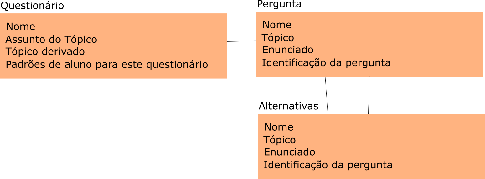 +
Fonte: elaborado pelo autor

*Aprendizado de máquina*:

O aprendizado de máquina implementado na solução utiliza das propriedades estipuladas no modelo de domínio de usuário, das propriedades estipuladas no modelo de domínio de questionários e o modelo de domínio de questões.
O que ocorre é uma combinação de todas as propriedades do aluno com todas as propriedades da questão que foi respondida, e que possui um endereçamento para o seu respectivo questionário.
Ao possuir as combinações de propriedades dos alunos com as propriedades das questões respondidas, para um determinado questionário, é possível construir uma probabilidade que cada propriedade de aluno aponta de uma alternativa a ser escolhida. Assim cada propriedade vai determinar uma probabilidade de o aluno com aquela propriedade responder cada tipo de alternativa disponível para aquele questionário.
Assim o aprendizado de máquina trabalha com uma tabela como esta, para uma questão de quatro alternativas que são "Rodrigo", "Bruno", "Gabriel", e "Victor", cujo a pergunta é "Qual o seu nome ?" em que o aluno possuí por exemplo definidas as propriedades idade, cidade:

|===
| Questão : | Qual o seu nome ?
|===
|===
| Alternativas | Rodrigo | Bruno | Gabriel | Victor
| Idade: 21 | 27% | 12% | 32% | 29%
| Cidade: São Paulo | 12%| 27%  | 32% | 29%
|===

Feito isso, para este determinado aluno, de idade vinte e um anos e da cidade São Paulo, o aprendizado de máquina tem que ter uma inteligência para determinar, dentro de um conjunto de probabilidades para cada alternativa possível, qual será provavelmente a respondida. Para isto, é feita a soma de cada uma das probabilidades de cada uma das alternativas, e teríamos para este mesmo aluno, uma os seguintes pesos para resposta de cada alternativa de acordo com as propriedades deste aluno:

|===
| Questão : | Qual o seu nome ?
|===
|===
| Alternativas | Rodrigo | Bruno | Gabriel | Victor
| Pesos | 39 | 39 | 64 | 58
|===

Feito isso, a inteligëncia concluí que, para este aluno, com idade 21 e cidade de São Paulo em suas propriedades, e levando somente elas em consideração, a provavel resposta do aluno deve ser "Gabriel". Isto não significa que a resposta é a correta, significa que, conforme o que foi aprendido com outros alunos, esta é a resposta esperada pela máquina.

Modelo elaborado para representar a lógica do aprendizado de máquina : 

{counter2:nfig}
[[fig:diag-tela4, Fig {counter:nfig}]]
_Figura {nfig}. Tela de menu do aluno._ +
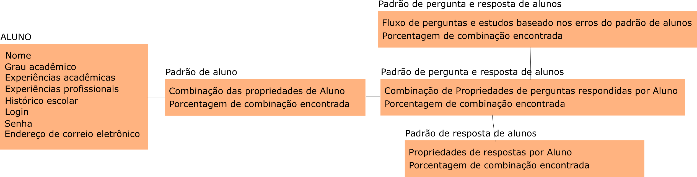 +
Fonte: elaborado pelo autor

=== Produção do software

Após a definição dos modelos de domínio, do levantamento dos requisitos, e do desenho detalhado das telas do usuário aluno, o desenvolvimento foi iniciado com o objetivo de atingir o resultado final por inteiro.

Foi utilizado o Domain Driven Design para arquitetar a solução e com base nas decisões de modelagem criadas a partir do paradigma de orientação a objeto, foram revisadas as tecnologias que seriam utilizadas no projeto, o foco para as escolhas das tecnologias foi em tornar o desenvolvimento didático, e tornar simples a manutenção futura da solução.

Tecnologias utilizadas:

*MongoDB* para banco de dados, linguagem de programação *C#* da microsoft, utilizando o .Net Framework.
O sistema operacional para rodar a aplicação tem que ser um Windows Server. O MongoDB pode ser colocado em uma máquina com sistema operacional Linux, porém deve ser corretamente apontado no arquivo de configuração presente na solução.

A solução foi preparada para ser dinamicamente configurada. Foi construído um "Framework" para melhorar o desenvolvimento com utilizando o banco de dados *MongoDB*, este framework abstrai a configuração de conexão entre a aplicação e o banco de dados utilizando um arquivo que utiliza da notação de objetos javascript (*JSON*).

A arquitetura previu a criação de um componente, framework, para aprendizado de máquina, este foi nomeado de "PUC.Log.Learn". Este componente é referenciado dentro do software da plataforma e realiza os cálculos de probabilidades, pesos, permutação de propriedades de objetos e chega a conclusão dado um determinado número de ocorrências registradas. O componente possui duas funções principais, a de inserção de ocorrência, que possui nome em inglês *InsertMemory* (inserir memória em português), e a função de conclusão única, possui nome em inglês *GetUniqueConclusion* (obter conclusão única).

Criado um componente para abstrair o aprendizado de máquina e outro para facilitar o desenvolvimento utilizando o banco de dados *MongoDB* foi necessária somente a implementação da análise feita das entidades e suas transições de estados.

A arquitetura seguiu o modelo M.V.V.C (modelos, visão, modelos de visão e controlador), criando também uma camada de operações de negócio chamada de *Service Layer* (camada de serviços em português) e uma camada de acesso a banco de dados chamada *ORM* (Object-Relational Mapping). É importante lembrar que o banco de dados é não relacional, porém o framework criado para facilitar a utilização do *MongoDB* abstrai as funções do banco de dados do código *C#*, e o desenvolvedor pode utilizar objetos *C#* relacionados entre si para definir a estrutura das coleções do banco de dados. Então para o desenvolvedor, os objetos são relacionados, para o banco as relações entre objetos são consideradas uma estrutura única de dados. Isto facilita operações que utilizam filtros e extração de dados do banco de dados, pois o resultado das buscas retornam na forma dos objetos que os descrevem e os filtros são feitos com base na estrutura dos objetos que descrevem as coleções do banco.

Foi elaborado um manual de como utilizar e como instalar a solução.
//TODO: MANUAL

== Resultado

=== Pesquisa

A pesquisa ajuda alunos que desejam complementar os seus estudos por meio de questões elaboradas de acordo com as regras estabelecidas pelo INEP para os exames do ENADE. Dispondo de um retorno informativo a respeito das suas respostas, espera-se ajudar o estudante com orientações a respeito de temas que ainda precisam ser melhor compreendidos.
A pesquisa tem como principal objetivo identificar as entidades de necessárias compreensões para estabelecer relacionamentos entre resultados esperados dos tipos de estudantes usuários da plataforma em seus estudos.
Padrões de alunos foram encontrados durante a pesquisa. Padrões de alunos que são definidos a partir da permutação das propriedades do modelo de domínio do aluno, que seriam além de seu nome, endereço de correio eletrônico, a instituição aonde estuda e entre outros. Cruzando as propriedades de alunos que responderam as mesmas questões é possível encontrar padrões de relacionamento entre suas propriedades e respostas de cada pergunta que responderam. 

==== Modelos

O objetivo refinar principal foi implementar um modelo de solução que ajudasse o aluno a desenvolver seus estudos sendo orientado por um algoritmo de aprendizado de máquina que chegue a conclusões sobre padrões de respostas de alunos para dizer o que era esperado do aluno e o que deve fazer para melhorar a performance de seu estudo.

O primeiro desenvolvimento feito foi o de modelagem do domínio e definição das restrições de domínio, os modelos se demonstraram complexos pois cada uma das entidades precisava ser granularizada de forma a permitir a manipulação de estruturas de dados para análise combinatória.

O desenvolvimento da experiência do aluno foi desenhada de forma a se tornar intuitiva e estabelecer a utilidade e as responsabilidades de cada tela. Além da utilidade de cada tela, podem ser definidas as estruturas de dados de cada tela e isso forma o modelo de visão. Feita a diferenciação da "visão", para o "modelo de visão" e o próprio "modelo" em termos de estruturas de dados, foi notado que a modelagem ideal para construir a experiência do aluno na plataforma seria o M.V.V.C (modelo, visão, modelo de visão e controlador).

==== Restrições

Foram pesquisadas as propriedades de um aluno comum, e descobertos vários padrões e combinações que estes alunos poderiam possuir. Notou-se que executar a tarefa de descobrir os padrões de alunos ou pré determiná-los pode tornar-se muito complexo, principalmente em casos de instituições de ensino internacionais aonde inúmeras características poderiam ser relevantes para a determinação dos padrões de alunos.

Com esta conclusão, ficou claro que o componente de aprendizado de máquina deveria se encarregar da determinação de padrões de alunos. A máquina deve utilizar em suas considerações artefatos em um determinado escopo, determinado pelo próprio cliente do componente. Para isso, cada permutação trabalha com uma restrição de domínio e cada memória (ocorrência) inserida na máquina um ambiente correspondente. Assim, para chegar a conclusão, o resultado deve estar sempre dentro dos chamados "valores relevantes", informados pelo cliente do componente, e somente deve considerar permutação de objetos que foram gravados em determinado ambiente.

Por exemplo, para chegar a conclusão de qual resposta é a mais provável para um determinado aluno, deve existir primeiro um ambiente correspondente a pergunta. Segundo, uma permutação das propriedades de um objeto de resposta com as propriedades de um objeto de aluno que respondeu a pergunta. Os valores relevantes são um conjunto de possíveis resultados, por exemplo: { "Alternativa 1", "Alternativa 2", "Alternativa 3", "Alternativa 4" } . Assim, estruturando também as combinações como uma coleção de pares chave e valor em um determinado ambiente, somente serão consideradas as combinações que possuem como valor algum dos valores relevantes determinados.

==== Experiência do usuário

Com o andamento da pesquisa foi pensado em utilizar o aprendizado de máquina para a montagem de um grafo com ligações entre tópicos acadêmicos, aulas que o professor monta em sua plataforma. Assim o sistema poderia ligar matéria, tópicos, em que o aluno obteve resultados abaixo do esperado, e fazer recomendações de acordo com o grafo determinado.

A tarefa de montagem da estrutura de relacionamento dos tópicos da plataforma deve ser do professor, a explicação para isto é trazer liberdade para o professor implementar a metodologia que desejar. Foram revisadas as metodologias de ensino aprendidas em cursos de ensino a distäncia, tais como metodologias de montagem e apresentação de telas, formatação de conteúdo, linguagem e estrutura de aulas, e vídeos que poderiam ser utilizados, e foi constatado que a plataforma para definir uma ordem de tópicos precisaria seguir uma lógica de busca por experiência de usuários e conteúdo dentro dos tópicos, e a metodologia de experiência do usuário (aluno) deve ser determinada pelo professor.

=== Software

O software previsto como resultado do trabalho de pesquisa foi implementado. O software foi desenvolvido utilizando o paradigma de desenho dirigido ao domínio, fundamentos de SOLID.

==== Componentes

Foram construídos diferentes projetos que funcionam juntos para formar a solução que é a plataforma de ensino resultante da pesquisa.
Os três componentes principais são o trabalho de camadas (Framework) do banco de dados, o projeto de aprendizado de máquina e inteligência artificial, e o projeto que possui as especificidades do negócio e a criação das telas.

{counter2:nfig}
[[fig:diag-tela4, Fig {counter:nfig}]]
_Figura {nfig}. Tela de menu do aluno._ +
image:fig/Componentes.PNG[] +
Fonte: elaborado pelo autor

A figura 10 mostra um modelo de como é a composição da hierarquia dos componentes. O banco de dados esta presente em todos os projetos, e o framework de banco de dados é utilizado em todos os outros componentes, sendo uma camada de abstração de operações do próprio software de comunicação com o banco de dados utilizando *C#* disponibilizado pela empresa criadora do MongoDB (mongodriver).

Por sua vez, o componente de machine learning está em constante comunicação com o componente de negócio.

==== Telas

Serão apresentadas as telas do software desenvolvido como resultado das pesquisas e experimento das metodologias criadas pela pesquisa para trazer rapidez, eficiencia, orientação e compreensão do ensino de um tópico ao aluno.
As telas foram criadas em Html para a criação do software resultado da pesquisa.

Os conjuntos de telas foram dividos em dois grupos principais, o primeiro é o grupo de telas dos alunos, e o segundo o grupo de telas dos professores.
Os dois possuem telas de login diferentes e um professor pode acessar os recursos dos alunos, porém os alunos não podem logar no gerenciador de professores.

===== Aluno

O conjunto de telas dos alunos é encarregado de lidar com todas as manipulações de dados que um aluno pode executar. Manipulações como fazer uma avaliação (exame criado pelo professor) de algum dos tópicos. Escolher os tópicos da plataforma que lhe interessam, visualizar a aula completa na estrutura planejada pelo professor. Também foi criada uma tela para visualizar um comparativo entre os resultados esperados de acordo com as propriedades do aluno e qual foi seu nível real de acerto. Também foi criada uma tela para recomendar tópicos de acordo com os tópicos que o aluno foi abaixo do esperado.

{counter2:nfig}
[[fig:diag-tela4, Fig {counter:nfig}]]
_Figura {nfig}. Tela de menu do aluno._ +
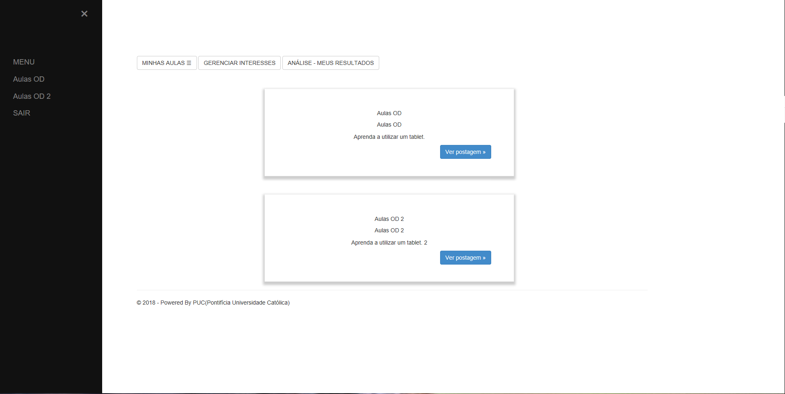 +
Fonte: elaborado pelo autor

Esta foi a tela representada pelo desenho do menu do aluno (figura 6), ela foi retratada em Html para poder ser visualizada na internet. Possui um menu lateral com todos os tópicos que o aluno disse que tinha interesse (utilizando a tela de gerenciar interesses). No centro da tela são os tópicos que foram escolhidos pelo aluno, porém com a descrição, o título, o sub-título e um botão de redirecionamento para fazer a aula do tópico.

{counter2:nfig}
[[fig:diag-tela4, Fig {counter:nfig}]]
_Figura {nfig}. Tela de aula._ +
image:fig/soft/Aula.PNG[] +
Fonte: elaborado pelo autor
No exemplo, uma das telas que um determinado professor configurou foi esta, da imagem (figura 9). Ela faz parte da experiência criada pelo professor para os alunos que estão estudando o tópico. Nesta tela, mostra-se o título, o sub-título, e o texto da página. Além disto, também é mostrado o menu lateral com os tópicos escolhidos para o aluno, e um botão de prosseguir para a próxima etapa, também configurada pelo professor, que pode ser o questionário ou não.

{counter2:nfig}
[[fig:diag-tela4, Fig {counter:nfig}]]
_Figura {nfig}. Tela de gerenciamento de interesses do aluno._ +
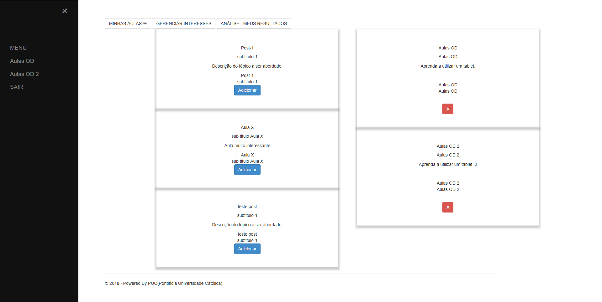 +
Fonte: elaborado pelo autor
No exemplo, foram criados alguns tópicos com nomes não relacionados com nenhum tópico de estudo real e também não correlacionadas com nada da realidade. A tela descrita pela "figura 10" tem a função de permitir o aluno adicionar e remover seus tópicos de interesses dentro da plataforma. Os que já estão adicionados a sua conta possuem um botão para desvincular de sua conta, representado com um "X" na cor vermelha. Os tópicos que o aluno não marcou como interesses de seu perfil possuem um botão de adicionar azul, que possui a função de adicionar aos tópicos de interesse do aluno.

Quando o aluno adquiri resultados abaixo do esperado, esta tela também é mostrada ao aluno, porém, no caso da "figura 10" esta sendo mostrado todos os tópicos cadastrados na plataforma, porém quando o aluno vai até a página por causa de um exame com nota abaixo do esperado, somente são mostrados os tópicos correlacionados (correlação feita pelo professor criador do tópico) aos tópicos que a performance não foi esperada.

{counter2:nfig}
[[fig:diag-tela4, Fig {counter:nfig}]]
_Figura {nfig}. Tela de resultados do aluno._ +
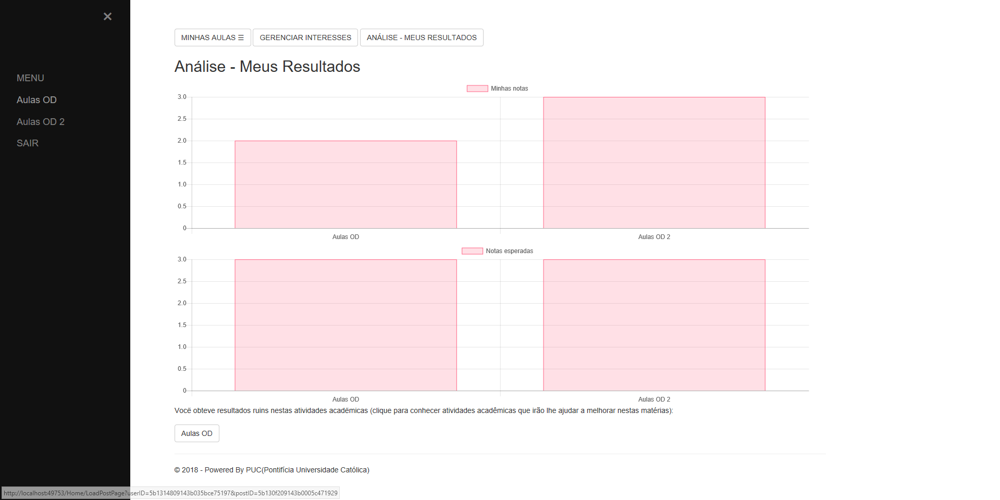 +
Fonte: elaborado pelo autor

No exemplo da imagem, o aluno possui dois tópicos cadastrados, nos dois, o aluno já fez a avaliação craida pelo professor, cada uma possui três questões. A nota esperada pelo aprendizado de máquina nas duas avaliações seriam a máxima, o acerto das três questões. Porém, o aluno acertou duas na primeira prova, prova do tópico "Aulas OD", e acertou as esperadas três questões na avaliação do segundo tópico citado.

Ao acertar um número abaixo do esperado na primeira avaliação criada pelo professor é habilitado um botão em baixo dos gráficos com o nome do tópico que o resultado esperado pelo aprendizado de máquina não foi atingido. O botão habilitado de baixo do gráfico redireciona o usuário para uma tela de gerenciamento de interesses, porém, somente são mostrados os tópicos que foram vinculados (pelo professor criador da matéria "Aulas OD") a matéria "Aulas OD".

{counter2:nfig}
[[fig:diag-tela4, Fig {counter:nfig}]]
_Figura {nfig}. Tela de exame do aluno._ +
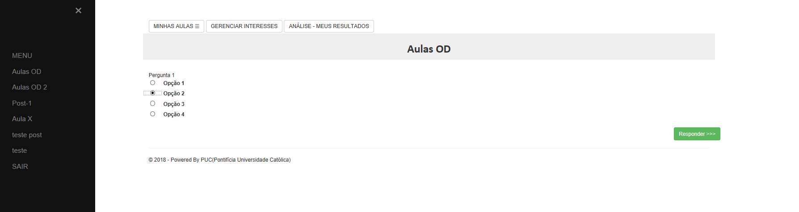 +
Fonte: elaborado pelo autor

A tela da figura 12 é a tela de resposta de uma das perguntas do exame (a avaliação criada pelo professor criador do tópico) Aulas OD. Aonde o aluno escolhe somente uma das alternativas configuradas pelo professor. Assim que clica no botão verde escrito "Responder" a tela muda para a próxima pergunta.

===== Professor

O conjunto de telas do professor manipula dados de conteúdo que os alunos acessam. Isto é, manipulam dados como criação de tópicos, que na plataforma foram chamados de "Aulas".
Também podem montar suas aulas inteiras pela plataforma, colocando fotos, vídeos e textos explicativos, nomes para cada página de tópico criada, ordem que as páginas irão aparecer para o usuário. Além disso, podem adicionar ou remover alunos. Outra função importante é a vinculação de um tópico a outros tópicos, que serão sugeridos ao aluno com menor nota do que o esperado para o perfil dele, no portal do aluno.

{counter2:nfig}
[[fig:diag-tela4, Fig {counter:nfig}]]
_Figura {nfig}. Painel de aulas programadas por um usuário professor._ +
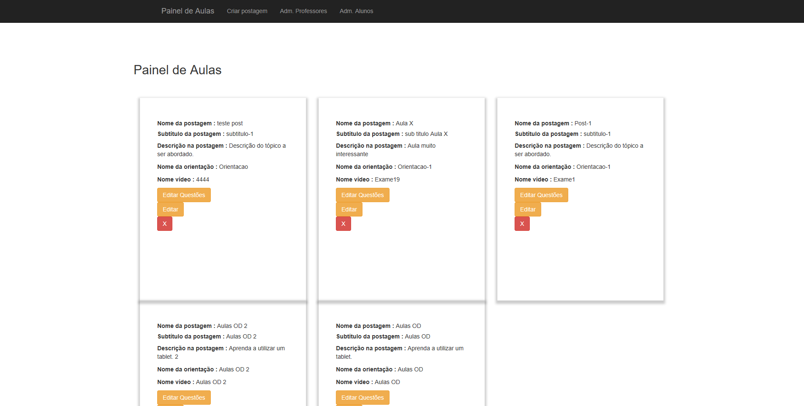 +
Fonte: elaborado pelo autor

Painel de aulas do professor, esta tela serve como tela inicial, referência para o professor sobre os seus tópicos, assim ele pode escolher se deseja criar um tópico novo, editar um tópico já existente, editar o exame de um tópico já existente, editar o conteúdo dos tópicos, adicionar ou remover alunos, adicionar ou remover professores ou configurar a experiência de ensino de um tópico.

{counter2:nfig}
[[fig:diag-tela4, Fig {counter:nfig}]]
_Figura {nfig}. Painel de Configuração de perguntas de um tópico programado pelo professor._ +
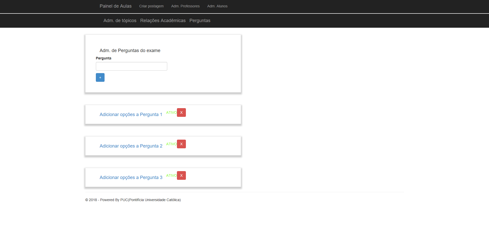 +
Fonte: elaborado pelo autor

Painel de edição de perguntas de um exame que possui três perguntas, uma como o nome "Pergunta 1" outra com nome "Pergunta 2" e outra com o nome "Pergunta 3". clicando no nome destas perguntas, o professor é direcionado a uma tela de edição de alternativas.

{counter2:nfig}
[[fig:diag-tela4, Fig {counter:nfig}]]
_Figura {nfig}. Painel de Configuração de perguntas de um tópico programado pelo professor._ +
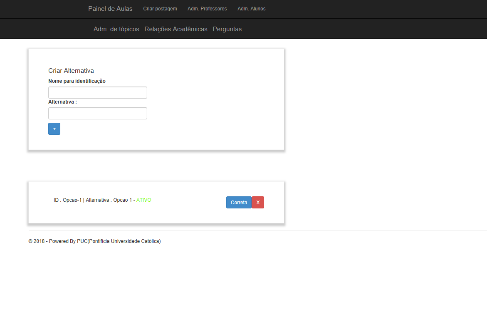 +
Fonte: elaborado pelo autor

A figura 15 se refere a o painel de edição de alternativas, que permite o professor a adicionar uma nova alternativa, remover, e escolher ela como correta ou incorreta. Ao remover uma alternativa, ela não é deletada, somente inativada. A alternativa deixa de aparecer para o aluno, mas por uma questão de registro de ocorrências, o professor sempre verá que alguma vez aquela alternativa foi criada, e foi inativada.

Na criação da alternativa, o professor deve preencher dois campos, um nome de identificação da alternativa e a alternativa que será exposta ao aluno que fizer o exame. O nome de identificação não pode ser repetido em uma pergunta, o nome que será exposto é definido pelo professor. O nome de identificação é importante internamente para a identificação posterior das alternativas de cada pergunta, tanto dentro do banco de dados quanto para o próprio professor que está montando o exame.

{counter2:nfig}
[[fig:diag-tela4, Fig {counter:nfig}]]
_Figura {nfig}. Painel de Configuração de páginas de orientações de um tópico programado pelo professor._ +
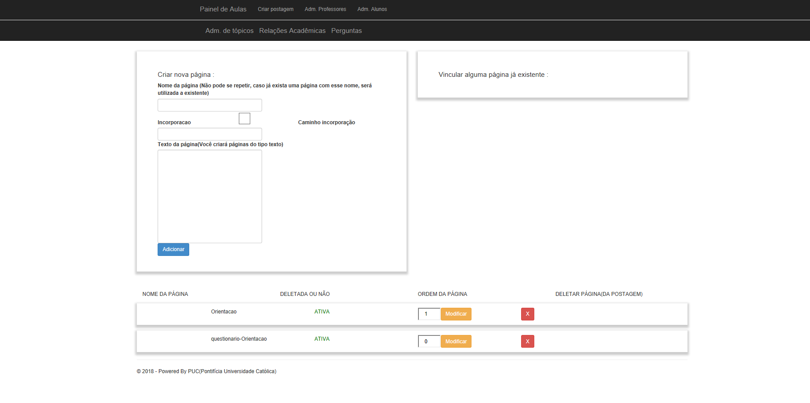 +
Fonte: elaborado pelo autor

A figura 16 é o painel de configuração de páginas inicial de qualquer tópico criado e sem adição de nenhuma página personalizada pelo professor. Nesta tela o professor pode adicionar novas páginas, alterar a ordem que as páginas aparecerão para os alunos, remover páginas, e vincular páginas já existentes em outros tópicos. A ordenação das páginas é dada pelos números na coluna "ORDEM DA PÁGINA" na parte inferior da tela, aonde a maior das ordens é a primeira página, e a menor é a última. Caso as ordens sejam iguais, as páginas são ordenadas por ordem alfabética.

==== Tutorial

==== Como deve ser utilizado

== Discussão

A pesquisa tem um objetivo claro, ajudar alunos a aprender os tópicos que lhe interessam de forma rápida, clara, e com auxílio de metodologias de aprendizado de máquina para avaliar seus resultados e lhe orientar durante próximos tópicos que lhe fossem de interesse. Foi encontrado um órgão público que elabora sistemas de avaliação para o ensino superior (INEP que organiza o exame do ENADE), este órgão possui suas metodologias de avaliação, elaboração de perguntas e questionários, estas para a pesquisa foram importantes, pois, com a análise, foi possível construir os modelos de domínio e elaborar restrições com base em suas metodologias, e a elaboração dos modelos iniciais de domínio e restrições de domínio foi o primeiro passo para construir uma plataforma realmente funcional e com uma experiência que ajudasse o aluno a aprender.

Tendo os modelos, foram criadas as decisões arquiteturais. As decisóes arquiteturais eram dependentes dos modelos de domínio, pois foi utilizada um paradigma chamado "desenho dirigido pelo domínio" (Domain Driven Design), este consiste em construir a arquitetura da solução com base no conjunto de decisões de modelagem tomadas nos modelos de domínio.

Durante o processo de definição da arquitetura (conjunto de decisões de modelagem) foram identificadas os componentes (pacotes) da solução, e utilizando dos princípios de SOLID (Principio da Responsabilidade Unica) foi pensado e arquitetado um projeto de aprendizado de máquina separado do projeto principal, que interpreta qualquer tipo de objeto de memória. Para lidar com tipos genéricos de memória que poderiam ser gravadas no aprendizado de máquina, foi definido que o componente deveria utilizar de estruturas de dados definidas dinâmicamente, característica do banco de dados escolhido, *MongoDB*.

Criado o componente de aprendizado de máquina com somente duas funções, as de "obter conclusão única" e "inserir memória correlacionada", foi criado um projeto (Framework) de banco de dados para facilitar a comunicação com o banco de dados escolhido e poder defini-lo com base na descrição das estruturas de dados descritas nas classes, assim evita-se a inclusão de estruturas de dados incorretas, e ao mesmo tempo pode-se trabalhar com a descrição que fosse, pois o projeto mapeia as propriedades descritas na classe e cria uma a uma na coleção do banco de dados. Arquiteturalmente, esta decisão funcionou muito bem, foi perfeita para a situação.

Então foi desenhada a experiência do usuário em forma de telas que seriam acessadas via internet. Isto significa que as telas foram pensadas levando em consideração que a arquitetura cliente servidor obriga o cliente a fazer constantes requisições ao servidor. Cada tela possui sua área de atuação e trabalha com as operações possíveis somente ao escopo da tela, por exemplo, uma tela de administração de usuários trabalha somente com as operações de deleção, atualização, inserção e seleção de usuário(s).

Ao tentar construir um grafo que pudesse criterizar e criar as correlações entre os tópicos foi notado que o professor deve possuir liberdade para montar o grafo que necessitar dentre os tópicos que julga relevante para seus alunos. Então o aprendizado de máquina foi limitado a função de verificar o resultado esperado para um determinado perfil de aluno. Esta foi uma decisão correta, pois existem fatores que não são possíveis considerar em um software que devem ser levados em consideração ao criar um grafo de correlações entre tópicos a serem abordados, tais como capacidade dos alunos, temas específicos determinados pelo professor para uma matéria.

=== Acertos

O primeiro acerto da pesquisa foi em sua fase inicial, de modelagem das entidades, aonde foram escolhidas as metodologias que seriam utilizadas e quais não seriam utilizadas do ENADE para a formulação dos modelos. A pesquisa limitou as metodologias que seriam utilizadas estas são as de: construção da pergunta, avaliação do exame, e construção de questionários. A metodologia de criação de perguntas foi diretamente utilizada na classe que descreve uma pergunta no sistema, e no modelo de domínio. A metodologia de construção de questionário também gerou um modelo que foi utilizado no sistema, e no modelo de domínio.

As decisões arquiteturais foram um sucesso como um todo, desde a separação dos componentes até a separação de suas funções utilizando o paradigma "desenho dirigido ao domínio". O paradigma escolhido levou a decisão de divisão de projetos, separando o componente de aprendizado de máquina, que possui o seu próprio domínio, do componente construído para facilitar as interações entre o banco de dados e as classes do projeto, a escolha da arquitetura de "modelo, visão, modelo de visão e controlador" permitiu o desenho das informações que seriam manipuladas por meio de classes do modelo de visão e a criação de classes de modelos fundamentais na camada de modelo.

A criação de um perfil de professor e as funções disponíveis dentro do portal para um professor foram acertos, todas as funções disponíveis ao professor foram pensadas na pesquisa com o objetivo de trazer total capacidade de manipulação da experiência do aluno dentre seus tópicos pelo professor. Por mais que o objetivo fosse criar um ambiente aonde o aluno conseguisse aprender os seus tópicos de interesse de uma forma rápida, fácil e orientada, foi notado que o professor possui um papel insubstituível na montagem da aula e da prova em um determinado tópico, possui também papel na escolha dos tópicos correlacionados a outros tópicos.

O tempo destinado para a modelagem do projeto e das entidades foi extenso, e realmente foi necessário bastante tempo para fazer a análise e o desenho completo da solução, determinar papéis, do aluno, do professor, do aprendizado, e decisões técnologicas que tornaram o desenvolvimento mais rápido e intuitivo (exemplo do paradigma de "desenho dirigido ao domínio").

=== Erros

O tempo destinado a criar uma metodologia para correlacionar tópicos de estudo criado por professores para orientar o aluno após uma nota abaixo da esperada foi desperdiçado, pois ao conseguir estabelecer os primeiros relacionamentos utilizando um algoritmo de aprendizado de máquina, foi notado que as correlações funcionariam no contexto mais comum, isto é, o contexto que a maior porcentagem dos professores se encaixariam. Isto porém não agradaria e não ajudaria o aluno a aprender pois a metodologia de ensino muda de acordo com o professor, e experiência de aprendizado do aluno depende da metodologia que o professor desejar utilizar em sua aula.

O tempo destinado na montagem das estruturas de dados das entidades de professores e alunos serviu para registrar que a estrutura de dados não pode ser padronizada, pois as propriedades de um aluno e de um professor mudam muito entre as instituições de ensino, por exemplo existem universidades que podem levar em consideração nas propriedades de seus alunos a renda de sua família, enquanto outra instituição de ensino pode levar em consideração o estado de nascimento do aluno. Estas devem ser especificadas pela instituição de ensino para refinar as combinações e probabilidades do algoritmo de aprendizado de máquina, não levando em consideração propriedades que não interessam.
//TODO RETIRAR PARTE SOBRE LICENCIATURA

=== Conclusão

== Bibliografia:

- http://download.inep.gov.br/educacao_basica/provinha_brasil/documentos/2012/guia_elaboracao_itens_provinha_brasil.pdf[Provinha Brasil]
+
- https://impa.br/wp-content/uploads/2016/12/helio_f_costa.pdf[Mestrado sobre produção de itens]
+
- http://www.uel.br/grupo-estudo/gepema/Disserta%E7%F5es/2014_disserta%E7%E3o_Ademir.pdf[Mestrado sobre enunciados de itens]
+
- http://www.publicadireito.com.br/artigos/?cod=480167897cc43b2f[Bloom nas avaliações discentes]
+
- http://www.portalavaliacao.caedufjf.net/wp-content/uploads/2012/02/Guia_De_-Elaboração_De_Itens_LP.pdf[Guia de elaboração de itens]
+
- http://www.adventista.edu.br/_imagens/area_academica/files/guia-de-elaboracao-de-itens-120804112623-phpapp01(3).pdf[Guia para questões de múltipla escolha]
+
- http://www.athenaseducacional.com.br/media/files/135/135_87.pdf[Guia de elaboração de itens]
+