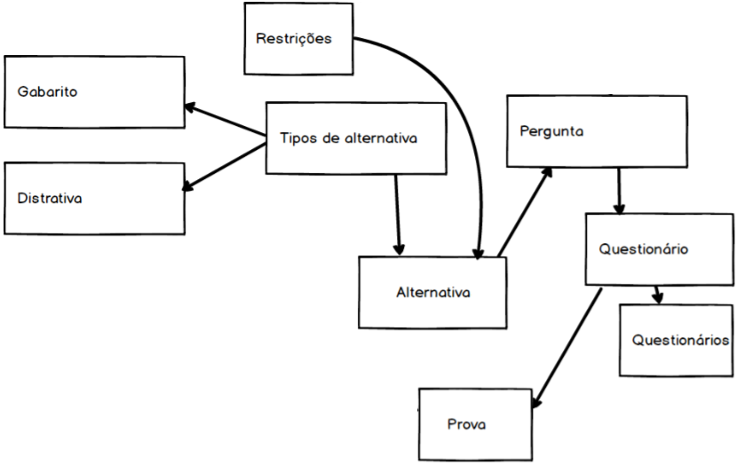

= Projeto Tutor de Estudos INEP: Relatório Final - Rodrigo Nogueira

:toc:
:toc-title: Sumário
:figure-caption: Figura
:sectnums:

////
2018/03/09: revisado por italo
////

////
https://github.com/cnt5bs/2017-ic-rodrigo
////

== Introdução

O trabalho de um aluno em uma instituição acadêmica pode ser avaliada de várias maneiras, uma das mais complicadas é utilizar o histórico de alunos para determinar se a performance de alguém foi satisfatória, e isso se dá porque é difícil criar os padrões de alunos conforme suas propriedades.

A pesquisa busca metodologias de avaliação do aluno utilizando técnicas de inteligência artificial e aprendizado de máquina para com estas ajudar na experiência e resultados de estudos dos alunos de instituições acadêmicas.
Foram selecionadas propriedades (de um aluno) para serem consideradas na criação dos padrões de alunos e suas respectivas provas e avaliações.

Primeiramente é feita a avaliação entregue pelo professor, a prova criada pelo professor. Após a avaliação do professor é feita a avaliação da máquina para determinar se o resultado que era esperado do aluno foi satisfatório ou não.

Para auxiliar na elaboração de prova e na avaliação da prova foi estudado o sistema de criação e avaliação de provas para o ensino superior do INEP (ENADE).

//INEP
Instituto que aplica o Exame referência no Brasil de avaliação de Instituições de Educação de ensino Superior. 
O Instituto Nacional de Estudos e Pesquisas Educacionais Anísio Teixeira (INEP) é o orgão responsável pela elaboração e subsidiação do exame ENADE.
O Instituto faz pesquisas e levantamentos neste ramo do ensino. 

Análisar o ENADE é de interesse da pesquisa pois podemos o utilizar como inspiração para elaboração de critérios e levantamento do modelo das entidades da pesquisa. 

O ENADE do ensino superior (Sistema Nacional de Avaliação da Educação Superior - Sinaes) tem como objetivo assegurar que o processo de avaliação das Instituições de Educação Superior (IES) ocorram de acordo com requisitos mínimos de aprendizagem, estabelecidos pelo MEC.
O que beneficia o aluno no sentido de ter garantido suas condições de avaliação.

A pesquisa, considera, como referência, os critérios e as respostas elaboradas pelo exame do INEP para o ensino superior (Sinaes), Enade (Exame Nacional de Desempenho de Estudantes).
Este exame visa avaliar a qualidade da educação oferecida pelas IES. 

Para a pesquisa, foram determinadas as metodologias de criação de avaliações do ENADE como base para criação das perguntas e alternativas dentro da plataforma da pesquisa. Estas são: Somente suportadas as criações de questionários com perguntas textuais (somente escritas, não possuem imagens) de resposta única, e com alternativas textuais.

Feito o estudo das metodologias do ENADE, para aplicação da prova foram elaborados os seguintes modelos de domínio :

{counter2:nfig}
[[fig:diag-mcq, Fig {counter:nfig}]]
_Figura {nfig}. Diagrama do modelo de estudante._ +
image:fig/ModeloUsuarioIC.png[] +
Fonte: elaborado pelo autor

{counter2:nfig}
[[fig:diag-mcq, Fig {counter:nfig}]]
_Figura {nfig}. Diagrama do modelo dequestionários._ +
 +
Fonte: elaborado pelo autor

{counter2:nfig}
[[fig:diag-mcq, Fig {counter:nfig}]]
_Figura {nfig}. Diagrama do modelo de domínio dos MCQs._ +
image:fig/ModeloMCQIC.png[] +
Fonte: elaborado pelo autor

Para auxiliar nos tópicos citados, elaboração da prova, fluxo e experiência de ensino de um aluno, utilizando das metodologias estudadas, foi criada uma plataforma de auxilio ao ensino em que o professor constrói a sua aula, e a experiência do aluno (ordenando e definindo o conteúdo de cada página que ele verá), escreve sobre o conteúdo que deseja, monta provas, e os alunos são avaliados e auxiliados pela plataforma.

É uma plataforma de ensino que auxilia o aluno em seus estudos avaliando, por meio de aprendizado de máquina, se o resultado foi o esperado para aquele perfil de aluno. Caso não sejam os resultados esperados, e o aluno tiver ido pior do que o esperado em alguma matéria, a plataforma de ensino recomenda ao aluno estudar outras matérias relacionadas para melhorar sua base conceitual.

O professor que utiliza a plataforma para montar as suas matéria possui um gerenciador de conteúdo que o permite montar uma sequência de slides da sua matéria, colocar vídeos, mais slides, criar páginas explicativas, escrever o conteúdo de sua matéria, organizar por tópicos, montar suas provas, determinar, mudar ou editar a ordem das páginas.
Para cada prova que o aluno faz, ele ganha uma pontuação no sistema, pontuação que ele poderá ver em uma página de "Análise dos dados", ao lado de uma análise de como o sistema esperava que ele fosse, e suas sugestões de matéria quando sua nota for menor do que a esperada.

As matérias relacionadas, que podem melhorar a base conceitual de um aluno, são definidas pelo próprio professor que cria a experiência de estudo da matéria em seu gerenciador de conteúdo. Assim as matérias recomendadas a um aluno que não conseguiu atingir o resultado esperado é uma recomendação do professor.

Utilizando desta plataforma, o aluno poderá ser avaliado conforme seu professor deseja, e com base no resultado de outras avaliações de outros alunos e a análise de suas propriedades, o sistema pode retirar padrões de alunos para dizer o que se era esperado de um aluno em alguma situação.

Com isso foram desenhadas estas telas como esboço de uam experiência simples de um aluno :

{counter2:nfig}
[[fig:diag-tela1, Fig {counter:nfig}]]
_Figura {nfig}. Tela de montagem dos tópicos a serem estudados do aluno._ +
image:fig/Tela1.png[] +
Fonte: elaborado pelo autor

{counter2:nfig}
[[fig:diag-tela2, Fig {counter:nfig}]]
_Figura {nfig}. Tela de questionário inicial do aluno._ +
image:fig/Tela2.png[] +
Fonte: elaborado pelo autor

{counter2:nfig}
[[fig:diag-tela3, Fig {counter:nfig}]]
_Figura {nfig}. Tela de mural do aluno._ +
image:fig/Tela3.png[] +
Fonte: elaborado pelo autor

{counter2:nfig}
[[fig:diag-tela4, Fig {counter:nfig}]]
_Figura {nfig}. Tela de resultados do aluno._ +
image:fig/Tela4.png[] +
Fonte: elaborado pelo autor

Como a plataforma foi implementada com sucesso, foram elaboradas estas telas em Html para serem utilizadas na Web.

Com o intuito de fazer integrações com outros sistemas, foi construído um serviço Web que recebe questionários, em "JSON" (Javascript Object Notation). Assim, os questionários podem ser elaborados e validados em outro software. Assim podem ser inseridos na plataforma da pesquisa via internet e utilizados para avaliar os alunos como se tivessem sido desenvolvidos internamente.

== Metodologia

=== Pesquisa

*Modelos*:

Para a elaboração de um modelo de domínio foi importante a definição de várias entidades que existiram durante o estudo das metodologias do ENADE. Além das entidades provenientes da pesquisa feita sobre as metodologias do ENADE, houve a necessidade de elaborar vários modelos definindo a montagem da experiência dos usuários. Foi definido também os tipos de entidades de usuário que influenciam a pesquisa.
Foram definidos duas entidades principais de usuários, a entidade de professor e a entidade de aluno.
Estas duas entidades tem dois tipos tipos de experiência diferentes dentro da plataforma desenvolvida.
Somente a entidade de usuário aluno é submetida a avaliação e a definição de padrões de perfil de alunos e a sugestões definidas pelos usuários de tipo professor.
Foram definidos também alguns modelos de tipo de questão e tipos de questionários. Modelos de questões e respostas foram elaborados conforme as limitações das elaborações de questões do ENADE, com a limitação de não poderem ser aceitas questões com imagens e vídeos, somente aceitas questões textuais.
Elaborados os modelos de domínio, para se ter a experiência de um usuário na plataforma da pesquisa, foi realizado o desenho de várias telas, e planos de navegação dos tipos de usuário. Os planos de navegação dentro da plataforma passaram por um processo de refinamento por conta da experiência visual do usuário aluno, a plataforma deveria ser intuitiva e de fácil utilização, principalmente por parte do aluno.

*Aprendizado de máquina*:

O aprendizado de máquina implementado na solução utiliza das propriedades estipuladas no modelo de domínio de usuário, das propriedades estipuladas no modelo de domínio de questionários e o modelo de domínio de questões.
O que ocorre é uma combinação de todas as propriedades do aluno com todas as propriedades da questão que foi respondida, e que possui um endereçamento para o seu respectivo questionário.
Ao possuir as combinações de propriedades dos alunos com as propriedades das questões respondidas, para um determinado questionário, é possível construir uma probabilidade que cada propriedade de aluno aponta de uma alternativa a ser escolhida. Assim cada propriedade vai determinar uma probabilidade de o aluno com aquela propriedade responder cada tipo de alternativa disponível para aquele questionário.
Assim o aprendizado de máquina trabalha com uma tabela como esta, para uma questão de quatro alternativas que são "Rodrigo", "Bruno", "Gabriel", e "Victor", cujo a pergunta é "Qual o seu nome ?" em que o aluno possuí por exemplo definidas as propriedades idade, cidade:

|===
| Questão : | Qual o seu nome ?
|===
|===
| Alternativas | Rodrigo | Bruno | Gabriel | Victor
| Idade: 21 | 27% | 12% | 32% | 29%
| Cidade: São Paulo | 12%| 27%  | 32% | 29%
|===

Feito isso, para este determinado aluno, de idade vinte e um anos e da cidade São Paulo, o aprendizado de máquina tem que ter uma inteligência para determinar, dentro de um conjunto de probabilidades para cada alternativa possível, qual será provavelmente a respondida. Para isto, é feita a soma de cada uma das probabilidades de cada uma das alternativas, e teríamos para este mesmo aluno, uma os seguintes pesos para resposta de cada alternativa de acordo com as propriedades deste aluno:

|===
| Questão : | Qual o seu nome ?
|===
|===
| Alternativas | Rodrigo | Bruno | Gabriel | Victor
| Pesos | 39 | 39 | 64 | 58
|===

Feito isso, a inteligëncia concluí que, para este aluno, com idade 21 e cidade de São Paulo em suas propriedades, e levando somente elas em consideração, a provavel resposta do aluno deve ser "Gabriel". Isto não significa que a resposta é a correta, significa que, conforme o que foi aprendido com outros alunos, esta é a resposta esperada pela máquina.

=== Produção do software

Após a definição dos modelos de domínio, do levantamento dos requisitos, e do desenho detalhado das telas do usuário aluno, o desenvolvimento foi iniciado com o objetivo de atingir o resultado final por inteiro.

Foi utilizado o Domain Driven Design para arquitetar a solução e com base nas decisões de modelagem criadas a partir do paradigma de orientação a objeto, foram revisadas as tecnologias que seriam utilizadas no projeto, o foco para as escolhas das tecnologias foi em tornar o desenvolvimento didático, e tornar simples a manutenção futura da solução.

Tecnologias utilizadas:

*MongoDB* para banco de dados, linguagem de programação *C#* da microsoft, utilizando o .Net Framework.
O sistema operacional para rodar a aplicação tem que ser um Windows Server. O MongoDB pode ser colocado em uma máquina com sistema operacional Linux, porém deve ser corretamente apontado no arquivo de configuração presente na solução.

A solução foi preparada para ser dinamicamente configurada. Foi construído um "Framework" para melhorar o desenvolvimento com utilizando o banco de dados *MongoDB*, este framework abstrai a configuração de conexão entre a aplicação e o banco de dados utilizando um arquivo que utiliza da notação de objetos javascript (*JSON*).

A arquitetura previu a criação de um componente, framework, para aprendizado de máquina, este foi nomeado de "PUC.Log.Learn". Este componente é referenciado dentro do software da plataforma e realiza os cálculos de probabilidades, pesos, permutação de propriedades de objetos e chega a conclusão dado um determinado número de ocorrências registradas. O componente possui duas funções principais, a de inserção de ocorrência, que possui nome em inglês *InsertMemory* (inserir memória em português), e a função de conclusão única, possui nome em inglês *GetUniqueConclusion* (obter conclusão única).

Criado um componente para abstrair o aprendizado de máquina e outro para facilitar o desenvolvimento utilizando o banco de dados *MongoDB* foi necessária somente a implementação da análise feita das entidades e suas transições de estados.

A arquitetura seguiu o modelo M.V.V.C (modelos, visão, modelos de visão e controlador), criando também uma camada de operações de negócio chamada de *Service Layer* (camada de serviços em português) e uma camada de acesso a banco de dados chamada *ORM* (Object-Relational Mapping). É importante lembrar que o banco de dados é não relacional, porém o framework criado para facilitar a utilização do *MongoDB* abstrai as funções do banco de dados do código *C#*, e o desenvolvedor pode utilizar objetos *C#* relacionados entre si para definir a estrutura das coleções do banco de dados. Então para o desenvolvedor, os objetos são relacionados, para o banco as relações entre objetos são consideradas uma estrutura única de dados. Isto facilita operações que utilizam filtros e extração de dados do banco de dados, pois o resultado das buscas retornam na forma dos objetos que os descrevem e os filtros são feitos com base na estrutura dos objetos que descrevem as coleções do banco.

Foi elaborado um manual de como utilizar e como instalar a solução.
//TODO: MANUAL

== Resultado

=== Pesquisa
==== Restrições
==== Modelos
==== Experiência do usuário

=== Software
==== Componentes
==== Telas
===== Aluno
{counter2:nfig}
[[fig:diag-tela4, Fig {counter:nfig}]]
_Figura {nfig}. Tela de menu do aluno._ +
image:fig/soft/SSMenu.PNG[] +
Fonte: elaborado pelo autor

{counter2:nfig}
[[fig:diag-tela4, Fig {counter:nfig}]]
_Figura {nfig}. Tela de resultados do aluno._ +
image:fig/soft/SSMeusResultados.PNG[] +
Fonte: elaborado pelo autor

{counter2:nfig}
[[fig:diag-tela4, Fig {counter:nfig}]]
_Figura {nfig}. Tela de gerenciamento de interesses do aluno._ +
image:fig/soft/SSInteresses.PNG[] +
Fonte: elaborado pelo autor
//TODO: TELA DE PROVA DO ALUNO
//TODO: TELA DE SLIDES DO ALUNO

===== Professor

{counter2:nfig}
[[fig:diag-tela4, Fig {counter:nfig}]]
_Figura {nfig}. Painel de aulas programadas por um usuário professor._ +
image:fig/soft/PainelDeAulas.PNG[] +
Fonte: elaborado pelo autor

{counter2:nfig}
[[fig:diag-tela4, Fig {counter:nfig}]]
_Figura {nfig}. Painel de Configuração de perguntas de um tópico programado pelo professor._ +
 +
Fonte: elaborado pelo autor

{counter2:nfig}
[[fig:diag-tela4, Fig {counter:nfig}]]
_Figura {nfig}. Painel de Configuração de páginas de orientações de um tópico programado pelo professor._ +
image:fig/soft/AdmUX.PNG[] +
Fonte: elaborado pelo autor

==== Tutorial

==== Como deve ser utilizado

== Discussão

=== Acertos
=== Erros
=== Conclusão

== Bibliografia:

- http://download.inep.gov.br/educacao_basica/provinha_brasil/documentos/2012/guia_elaboracao_itens_provinha_brasil.pdf[Provinha Brasil]
+
- https://impa.br/wp-content/uploads/2016/12/helio_f_costa.pdf[Mestrado sobre produção de itens]
+
- http://www.uel.br/grupo-estudo/gepema/Disserta%E7%F5es/2014_disserta%E7%E3o_Ademir.pdf[Mestrado sobre enunciados de itens]
+
- http://www.publicadireito.com.br/artigos/?cod=480167897cc43b2f[Bloom nas avaliações discentes]
+
- http://www.portalavaliacao.caedufjf.net/wp-content/uploads/2012/02/Guia_De_-Elaboração_De_Itens_LP.pdf[Guia de elaboração de itens]
+
- http://www.adventista.edu.br/_imagens/area_academica/files/guia-de-elaboracao-de-itens-120804112623-phpapp01(3).pdf[Guia para questões de múltipla escolha]
+
- http://www.athenaseducacional.com.br/media/files/135/135_87.pdf[Guia de elaboração de itens]
+